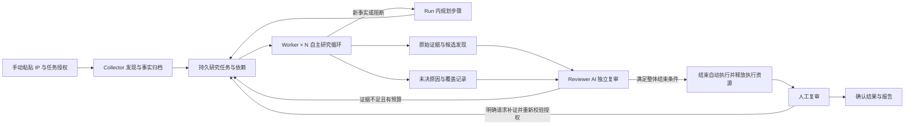
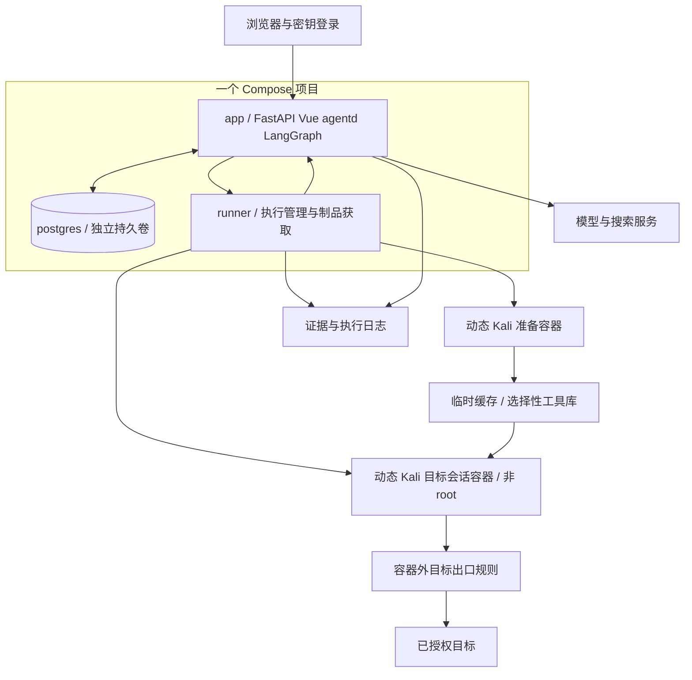

# HuntWeave 项目总纲

版本：0.8.3 · 更新日期：2026-10-09 · 状态：P0-A 至 P0-D 已验证，真实执行仍未开放

本文件用于统一产品、架构、Agent harness、授权边界和交付标准。后续需求拆分、数据库设计、接口实现、提示词编写、工具接入和验收均以此为起点；用户后续明确调整的需求优先，并应同步更新本文件。

本文依据用户需求与当前确认的产品、架构决策编写。旧稿是历史讨论资料，其中的待定建议不自动成为本项目要求。下文描述完整首版目标，不代表所有模块和接口均已实现；当前可运行成果与限制见 README 和 docs/validation/。

0.7 保留已经确定的产品与技术选型，补齐模块职责、状态归属、执行恢复与开工验收。当前结论以本文件为准；[ADR 索引](./docs/adr/README.md) 区分有效决定与历史取舍，旧 ADR 的默认 root、SQLite、完全自研及严格单容器选择不得用于新实现。下一步直接执行 [P0 工程与运行契约规格](./docs/specs/0001-foundation.md)。

0.7.1 取消单服务研究时长上限，由 LLM 自主决定研究推进或放弃；保留执行超时与 Run 时间窗，具体规则见第 12 节。

0.7.2 记录 P0-B 身份、授权与持久 Run 交付。产品品牌统一使用 HuntWeave，不设独立中文名称。

0.8 根据覆盖、恢复与持续运行需求，保留现有技术栈与执行隔离，补充证据驱动的任务规划和上下文组织。

0.8.1 明确 24×7 是一次发布后的单个 Run 自主持续推进，完成后停止；删除周期性创建新 Run 的设计与固定四小时执行上限。当前只更新架构文档，相关能力尚未实现；决定见 [ADR-0009](./docs/adr/0009-adaptive-research-and-continuous-execution.md)，问题、方案与验收依据见[架构改进研究](./docs/research/2026-10-09-architecture-improvement.md)。

0.8.2 补齐 P2 自动阶段结束、持久等待与唤醒、并发完成判定的契约。正常顺序明确为自主渗透并留证、AI 复审及有限补证、结束自动执行、人工复审；保持现有模块与部署结构，不扩大 P0 实施范围。

0.8.3 记录 P0-C/D 交付：LangGraph 角色闭环、持久假 Runner、证据归档、事件时间线与暂停/取消/对账/恢复，验证见 [P0-C/D 验证记录](./docs/validation/0005-p0-execution-and-recovery.md)。产品仍处于假执行阶段，真实执行未开放。

阅读顺序：第 2 节看固定选型，第 5 节看研究规划，第 6–8 节看部署、模块和状态，第 9–12 节看权限、工具、证据与透明性，第 13–14 节看代码组织和验收。本文描述完整首版与注明阶段的后续方向；P0 只实现规格中明确列出的第一条闭环。

## 1. 项目名称与定位

**项目名称：HuntWeave；代码标识：`huntweave`。**

Hunt 表示 Agent 围绕漏洞持续提出假设、选择工具和验证问题；Weave 表示 Collector、多个 Worker、Reviewer 与人工复审共同连接研究过程和证据。

2026-10-08 完成公开名称初查：GitHub 仓库名称查询未返回 `HuntWeave`，常见分隔符变体未发现规范化后同名的结果，PyPI 与 npm 的 `huntweave` 包端点均返回 404。此结论仅描述查询时的公开结果，不保证全球唯一、包名可注册、商标或域名可用。更名原因、候选筛选和查询依据见 [命名决策 ADR-0001](./docs/adr/0001-project-name.md)。

**一句话定位：面向自有或明确授权目标，由 LLM 驱动研究决策、由程序约束执行、以可追溯证据和人工复审形成结论的 Agent 安全测试平台。**

平台的使用前提是目标已获授权。项目开发不等于对任何实际 IP 发起测试的授权；实际任务以操作员配置的目标、有效期、操作类别和预算为执行依据。平台记录授权说明和范围，不建设资产所有权认证、SRC 归属核验或法律审查系统。

平台核心价值在于下面这个闭环：

> 观察事实 → 提出假设 → 选择工具和验证方法 → 分析结果 → 调整下一步 → 固化证据 → 独立复审 → 人工确认。

LLM 是决策者：可以改变研究路线、放弃不成立的假设、请求补充条件和选择结束。报告撰写是闭环的最后一部分。工具只是执行手段，不能把项目实现为固定扫描器流水线加一份模型总结。

## 2. 本轮确定的决策

| 事项 | 开发基线 |
| --- | --- |
| 产品范围 | 已授权目标的 Agent 安全测试；Agent 自主研究 Web 与非 Web 服务，不以预写协议适配器为前提 |
| 目标来源 | 操作员手动复制粘贴 IP；首版不接入外部资产来源 |
| 工作流 | `Collector → Worker × N → Reviewer → 人工复审`，允许有预算的补证回路 |
| 研究组织 | 服务事实与研究任务分离；Run 内按新证据增量规划，Worker 保留方法选择，PostgreSQL 保存任务依赖与去重状态 |
| Agent harness | LangGraph OSS 提供检查点、暂停恢复与事件流；项目实现领域、工具、执行与证据层 |
| 技术栈 | Python + FastAPI + Vue 3 / TypeScript + PostgreSQL + Docker Compose；控制服务 Debian slim，工具环境 Kali |
| 数据与任务 | PostgreSQL 承载业务数据、持久队列、事件与独立 schema 的图检查点；SQLAlchemy + Alembic |
| 证据文件 | 本地持久卷 + 数据库索引、校验哈希和访问控制；后续可替换对象存储 |
| 工具链 | 核心预装 + 临时任务环境 + 限额短期缓存 + 选择性工具库；高频/明确保留才长期保存，Run 固定版本 |
| 执行身份 | 默认普通用户 Shell；用户态安装优先；按需提权经有限 helper/服务执行，不开放任意 sudo |
| 联网研究 | 自主查询 CVE、公告、PoC/EXP 与利用工具；获取、安装、执行分别留痕，权限内自动推进 |
| Web 访问 | 全局访问密钥换取服务端会话；主页、业务 API、事件流与证据均由服务端鉴权 |
| 首版部署 | 单机单组织，一个 Compose 入口；app/postgres/runner 三个常驻服务，工具容器按需创建 |
| 更新与扩充 | 官方镜像发布与部署者工具更新分开；下游可本地构建 toolpack，不要求作者逐次发版 |
| 过程透明 | 任务树、决策摘要、来源、实际命令/输出、工具版本、提权、阻断、预算、检查点和恢复全程可见 |
| 首版闭环 | 手动 IP → 服务发现 → 自主选择协议/工具与联网补充能力 → 证据 → 复审；HTTP/Redis 为验收样例 |
| 人工介入 | 创建任务时确定执行权限；权限内自动运行；超出已有权限的具体计划再申请；最终人工复审 |
| 24×7 自主执行 | P2 首版发布一次 Run 后在有效授权与预算内持续研究、复审并自动推进；完成后停止，进程重启后恢复同一 Run |
| 暂不引入 | Temporal 独立服务、Redis 队列、Celery、Kubernetes、向量数据库、强制云追踪服务 |

这些是当前工程选择，不是“某框架已经被证明最优”的结论。先以完整闭环和故障恢复验收，后续架构调整需要说明实际问题、收益、迁移成本与验证方法。

## 3. 范围：做什么、暂不做什么

### 3.1 首版必须做到

- 手工导入 IP，预览、校验、去重，配置授权时间窗、端口范围、执行策略和预算。
- 对导入 IP 进行范围内的端口发现、服务识别和事实归档；不能把裸 IP 直接等同于 `http://IP:80`。
- 多个 Worker 并行研究不同服务；根据真实工具结果继续、转向、补证或结束。
- Run 启动后在已授权范围内自主持续推进，直至可执行研究与自动复审结束；人工复审处理自动阶段形成的结果，不逐步批准权限内动作。
- 提供结构化工具调用、请求构造、证据读取与 Finding 提交能力。
- 提供普通用户 Shell、文件读写、用户态安装、编译和运行能力，按需申请具体特权动作；新协议不要求先开发平台适配器。
- 对未预编排的方法，能结合当前访问条件搜索资料、建立假设、编写验证代码、处理失败并补充证据；不把协议名称或预设检查清单当作能力上限。
- Agent 自主联网查询组件公告、CVE、公开 PoC/EXP 与利用工具，分析适用条件并在既有任务授权内安装和验证。
- 通过全局密钥登录，服务端保护主页、业务 API、实时事件和证据访问；未配置密钥时拒绝开放业务服务。
- 保留工具原始输出和可用的原始交互；明确哪些证据未采集、被截断或脱敏。
- Reviewer 能判定证据不足、要求补证、拒绝结论、标记重复或推荐人工确认。
- 人工能够查看决策摘要、证据、覆盖情况，确认、驳回或要求继续验证。
- 具备预算、超时、取消、任务租约、检查点和重启恢复能力。
- 一次性工具默认临时，高频或明确保留的工具跨任务复用；缓存有容量与期限，更新不影响在跑任务，保留/回收依据可查看。
- 测试过程和各种中断原因实时可见，断线后可补拉事件；无输出时仍有心跳和真实执行状态。

### 3.2 明确移出本轮产品

| 不纳入首版 | 处理方式 |
| --- | --- |
| SRC 归属标记、厂商归属、赏金规则、SRC 评分和提交流程 | 不创建相关字段、菜单、提示词或后台任务 |
| FOFA、Shodan、ZoomEye、Hunter 等空间资产测绘 | 不创建客户端、API Key 配置或占位入口 |
| 搜索引擎、证书关联、ASN/网段扩展等自动找新资产 | 不从已有目标自动扩大授权目标集合 |
| 域名、URL、CIDR、ASN 作为批量目标来源 | 首版 IP 输入接口明确拒绝；以后作为独立需求评估 |
| 对所有协议与漏洞的检测效果保证 | 可以通过通用工具研究未预置适配器的协议；只对实际验证过的能力声明覆盖 |
| 任意公网探测、任意宿主权限、无记录的一键远程脚本执行 | 自主获取/安装/执行已纳入范围，但仍需授权目标、来源记录、执行票据和容器隔离 |
| 企业多租户、复杂 RBAC、计费、插件市场 | 后续有实际需求再设计 |
| 多机调度、分布式高可用 | 首版单机可恢复；根据实测容量决定是否扩展 |
| 周期性自动复测与从头重扫 | 不属于这里的 24×7 自主执行；修复复测由明确请求创建新的 Run，并关联原发现与历史证据 |

这里排除的是**外部资产发现**。对手动导入的 IP 做授权端口发现和服务识别，是 Collector 的必要职责，必须保留。首版联网研究用于查询已知服务的漏洞与工具，不得借此导入新的测试目标。

## 4. 用户流程与目标模型

### 4.1 最小可用流程

访问控制台时，未登录者仅看到全局密钥输入页；成功建立服务端会话后进入以下流程。

1. 新建项目，填写用途、负责人和授权说明或内部授权记录引用。
2. 粘贴每行一个 IP，看到合法项、重复项、错误行和规范化后的清单。
3. 选择端口配置、授权有效期、操作策略、并发和预算，预览后启动一次 Run。
4. 在“玻璃鱼缸”任务页查看 Agent 树、当前假设与依据摘要、搜索来源、实际命令、实时输出、版本/权限变化和剩余预算。
5. 查看 Reviewer 结论，必要时批准一个具体补充计划或补充访问条件。
6. 人工确认发现，导出带证据引用、验证方法、限制和覆盖情况的报告。

授权设置随 Run 固化为快照。无需每次调用工具都确认；只有缺失必要权限、目标条件或确需超出原计划时才等待人工。常规重试、只读分析和已授权的验证自动进行。

### 4.2 IP 与服务语义

- IP 输入支持 IPv4 和 IPv6；忽略空行和首尾空白，使用标准 IP 解析器规范化、去重。首版不接受混入端口、协议、域名、网段或任意命令的行。
- 错误行需修正或明确移除后才能提交，不静默丢弃。IPv6 链路本地地址及 zone ID 首版不支持；未启用并验证 IPv6 出口隔离的部署不得运行 IPv6 任务。
- IP 是授权目标，`IP + transport + port` 是服务定位键。服务协议、组件和版本是带来源与置信度的观察结果，不能仅由端口号推定。
- 默认选择版本化的 `common-tcp-v1` 端口集合，并在启动页展示展开后的具体端口。操作员可明确选择自定义 TCP 端口或全 TCP 端口；不默认为全端口扫描。UDP 探测后置。
- 不把 ping 失败等同于主机不存在；记录不可达、超时、拒绝连接与未知状态。
- 私有地址可以是正常授权目标。平台控制服务、数据库、宿主机管理接口、云元数据地址等进入单独的保护清单，不能因目标被导入而自动放开。
- HTTP/HTTPS 入口需记录实际连接 IP、端口、scheme、Host、TLS SNI 和入口路径。一个 IP 可能承载多个应用，IP 直连只能覆盖实际访问到的入口。
- 用户可以为已导入 IP 手动补充一个经授权的虚拟主机名，用于 Host/SNI；它是该 IP 的访问参数，不自动增加域名解析所得 IP。缺少这些条件时，报告明确说明覆盖限制。
- 重定向、证书、响应体、页面链接中出现的新域名或 IP 只作为线索；不能自动加入授权范围。

## 5. 多 Agent 工作流



### 5.1 角色职责

| 角色 | 输入与职责 | 持久化输出 | 不承担的职责 |
| --- | --- | --- | --- |
| Collector | 根据授权端口配置发现服务；解释指纹；在范围内选择补充识别 | Host、Service、Observation、ResearchTask | 不搜索外部资产，不直接确认漏洞 |
| Worker | 基于事实提出假设，自主检索情报、安装/编写工具、执行和分析，调整路线 | Hypothesis、Decision、ToolCall、SourceArtifact、候选 Finding、Coverage | 不修改授权策略，不自行批准额外权限，不直接写最终结论 |
| Reviewer | 在新上下文中检查事实、证据和反例，必要时请求独立复现 | Review、补证任务、推荐结论 | 不以“另一个模型同意”代替证据，不绕过执行层复现 |
| 人工复审 | 查看证据，确认影响和结论，驳回或要求补证 | HumanDecision、最终报告版本 | 不要求人工逐次确认权限内的工具调用 |

Collector 是一个角色边界：输入校验、端口结果解析、去重等由确定性程序完成；存在指纹歧义时才调用模型做分析和补充识别决策。不要为了多 Agent 的形式让每个步骤都消耗模型调用。

Worker × N 表示同一能力池的多个独立研究会话，首版不为每种漏洞创建独立常驻 Agent。任务默认按服务拆分，上下文按会话隔离；共享事实、依赖、去重与预算通过数据库协调，不依赖 Agent 之间自由聊天。Run 内规划步骤负责跨任务的组织，Worker 自主选择任务内的方法；其职责和限制见第 5.4 节。

### 5.2 Worker 必须具备的决策能力

每个研究循环能在以下动作中选择：

- `request_tool`：选择已注册工具，提交结构化参数与用途。
- `search_web / fetch_source`：自主决定查询词、来源与待下载资料，保留引用和版本。
- `shell_exec / file_read / file_write`：在当前普通用户会话沙箱中检查环境、安装用户态依赖、编写脚本、调用工具并读取结果。
- `request_privilege`：提交有限特权动作及理由，按已有策略自动执行或等待具体授权；不切换为无限制 root Shell。
- `prepare_tool / request_network_mode`：准备新增工具及依赖，申请适合该用途的独立环境；Runner 按授权配置网络，接触过目标数据的会话不得切回公网准备模式。
- `record_hypothesis`：记录待验证主张、支持证据、反例与下一步验证条件。
- `read_evidence`：按证据 ID 和范围读取完整输出的相关片段。
- `submit_finding`：引用证据提交候选发现。
- `request_approval`：形成范围明确、行为明确的补充验证计划。
- `finish_research`：以已验证、已排除、预算耗尽、缺失认证、研究后仍无法准备环境等原因结束；没有现成适配器本身不是结束理由。

决策日志记录简短的依据、动作、预期现象和停止条件，不要求模型暴露或保存内部思维链。事实与假设使用不同字段；摘要不能把“可能”改写为“已证实”。

一次闭环验收必须能展示：同样的初始服务，在不同返回结果下，Worker 选择了不同的下一步。固定执行 nmap → nuclei → 报告不满足这一要求。

研究方法不采用封闭枚举。Worker 可以根据获得的访问条件提出新的能力假设，搜索方法与前置条件，组合客户端、脚本或已有工具验证，再依据失败原因修正。先记录“方法是否适用”和“实际观察到什么”，不能把找到一篇文章等同于目标具备该能力。结构化决策约束的是执行与证据格式，不是把模型的研究路径写死。

### 5.3 Reviewer 与人工复审

正常交付顺序是 **自主渗透并由执行层留存原始证据 → Reviewer AI 独立复审及有限补证 → 自动阶段结束并释放执行资源 → 人工复审**。AI 复审属于自动阶段；权限内的补证仍由系统自主推进。人工未处理结论不影响自动阶段结束、执行进程与连接回收，证据按保留策略留存。AI 复审无法完成时按第 12 节标记原因和未完成状态，再交人工处理，不声称已通过 AI 复审。

Reviewer 从证据索引和候选发现构建独立上下文，不直接继承 Worker 的整段对话。审查主张是否超出证据、前置条件是否成立、是否存在合理反例，以及是否值得补证。

Reviewer 输出：`recommend_confirm`、`needs_evidence`、`reject`、`duplicate`。补证任务必须写明缺口、目标、允许动作、预算和停止条件。默认最多自动补证两轮；超限进入人工复审。

复现统一通过 harness 和 Runner 创建新的 ToolCall，并受同一范围与预算限制。更换模型可以增加判断差异，但不自动提高证据等级。

Reviewer 使用新的身份、工作区和沙箱，依据已记录的工具/环境版本复现，可只读复用工具库；不复用 Worker 修改过的可写环境。重建失败时标明环境问题，不能把它等同于漏洞不成立。

人工输出：`confirmed`、`rejected`、`needs_evidence`、`deferred`。机器建议与人工结果分别保存，不相互覆盖。没有 Finding 的 Run 也要提供研究覆盖和未决原因，不能简单显示“安全”。

### 5.4 证据驱动的研究任务规划

P2 在四角色闭环中补充 **Run 内规划步骤**：根据服务事实、访问条件、已有假设、覆盖缺口和剩余预算，提出 ResearchTask 的新增、依赖、优先级或结束建议。它是 harness 的内部决策能力，不增加常驻 Planner 服务，也不接管 Worker 的每次工具选择。确定性调度器负责选择可领取项，模型只在需要研究判断时参与规划。

研究组织区分三种关系，均不要求新增图数据库：

| 关系 | 保存什么 | 不负责什么 |
| --- | --- | --- |
| 服务事实关系 | Host、Service、WebEndpoint 与带来源/时间的 Observation；未知、矛盾和过期事实分别保留 | 不把发现的新地址变成授权目标，不把模型推测变成事实 |
| 研究依赖关系 | ResearchTask、Hypothesis、前置条件、派生任务和证据引用，组成 Research Frontier | 不用任务完成、计划勾选或图节点着色证明漏洞成立 |
| LangGraph 执行图 | AgentSession 的决策、等待、观察、复审及恢复阶段 | 不为每个协议/漏洞写死研究路线，不替代业务任务或 Runner 账本 |

Collector 根据已授权端口发现服务并产生初始任务，不要求模型先规划每个确定性动作。Worker 在自己的任务内可以查询新资料、尝试客户端、准备工具和修正假设；需要另一项研究或条件时提出带来源的任务建议，不能递归创建不受预算和数量限制的 Agent。

触发跨任务规划的有效变化包括新服务/关键观察、访问条件变化、分支阻断、任务完成和 Reviewer 补证缺口。相近事件合并后按增量处理；空闲时等待事件或已记录的唤醒时间，不为每个心跳、输出块或调度轮询请求模型。规划开销计入研究预算；模型暂不可用时，已获校验且前提仍有效的任务可继续，依赖新判断的部分明确等待。

规划产物是带事实版本和任务版本的变更建议，由 runs 统一校验范围、前提、重复项、依赖环、预算和状态后提交。规划者不能直接派发命令、修改授权、覆盖正在执行的任务或裁定 Finding；过期建议需基于新状态重新判断。只有已派发动作真实收尾后，相关任务才能结束或被替代。

共享信息使用同 Run 内的结构化观察、反例、已尝试方法和证据引用；记录是谁在什么条件下观察到什么。其他 Worker 按任务相关性读取，新信息可以解除明确的依赖或产生新假设，但不能作为跳过验证的指令。跨服务研究必须列出全部服务绑定并分别通过授权检查，不从关联主机名、账号或地址自动扩大范围。Reviewer 仍从原始证据索引独立构建上下文。

例如同一授权 IP 发现 HTTP 与 Redis 服务后，可以产生两项研究任务。Redis 返回认证要求时，需要认证的研究分支记录阻断条件，其他具备条件的 Redis 方法和 HTTP 分支仍可推进；有效访问条件补充后再重新评估受阻分支。发现相同组件的新公告只产生适用性假设，不直接产生漏洞结论。规划需要据此改变后续任务，而不能只反复执行固定扫描清单。

## 6. 总体架构与 Compose 交付

采用**一个 Docker Compose 项目、三个常驻服务、按需工具容器**。用户完成配置后从一个入口启动，首版不维护另一套单容器生产发行版。选择多容器是为了分别管理平台、数据库和可执行第三方代码的环境，避免在一个容器内再自建全部隔离与升级机制。



### 6.1 服务、身份与启动

| 单元 | 职责 | 身份、数据与边界 |
| --- | --- | --- |
| app（常驻） | Vue 构建产物、FastAPI、独立 agentd 进程及 LangGraph | 非 root；持有模型/搜索与业务数据库凭据，不运行第三方工具、不挂 Docker socket |
| postgres（常驻） | 领域数据、队列、事件与图检查点 | 固定主版本的官方镜像、独立卷和账号/schema；只允许控制网络访问，不发布宿主数据库端口 |
| runner（常驻） | 校验票据、创建/停止容器、出口策略、获取与制品归档 | 最小受信管理服务；只有它接触所需 Docker/宿主网络管理接口，不在管理进程内执行下载的工具 |
| 准备容器（动态） | 下载、用户态构建；必要时按授权 profile 安装系统依赖 | Kali 工具基础，不含目标数据/平台秘密；构建 root 限于本准备环境 |
| 目标/Reviewer 容器（动态） | 当前会话的 Shell、客户端、脚本与验证 | 默认普通用户，只读基础/工具版本 + 本会话工作区，无数据库凭据、Docker socket 或管理 API 访问 |

app 内 API 与 agentd 可复用一个镜像并由进程管理器监控，不要求每个 Agent 各部署一套微服务。数据库就绪、迁移成功、密钥与 Runner 能力检查通过后才开放对应操作；服务异常如实反映到健康状态和玻璃鱼缸。任务不依赖 Web 请求生命周期。[FastAPI 后台任务](https://fastapi.tiangolo.com/tutorial/background-tasks/)

基础常驻容器数为三个，实际容器数随准备任务、Worker 和独立 Reviewer 会话增加。默认空闲时只有常驻服务；CPU/内存不足通过队列与并发预算处理，不声称多 Agent 不消耗资源。

持久卷分别保存 PostgreSQL、执行日志/证据、缓存/工具库；工具会话仅看到自身工作目录和所需工具只读内容。服务凭据不进入工具环境。只有 Web 入口发布到宿主，默认本机访问，远程部署使用 HTTPS。

持久卷的写入者必须明确：PostgreSQL 独占数据库卷；Runner 独占执行账本、原始证据归档和工具缓存的写入口，app 仅通过只读证据挂载及数据库索引读取，删除/回收由 Runner 接收受认证请求后执行。目标容器不挂载归档、其他会话目录或共享缓存的可写路径。数据库备份与证据清单共同形成恢复点，执行账本丢失不能被业务表中的旧状态掩盖。

Runner 通过经身份认证的控制 API 核对持久 ToolCall、范围、审批、租约及撤销，不相信模型或请求中的“已批准”字段。管理接口不提供通用 Docker API 代理；容器镜像、挂载、网络、capabilities 与标签由固定 profile 决定。即使 Docker socket 只挂给 Runner，也仍有很高权限，不能当作普通无风险连接。[Docker 安全边界](https://docs.docker.com/engine/security/)

app↔PostgreSQL 与 app↔Runner 使用内部控制网络，动态工具/准备容器不得加入。Runner 控制请求使用独立服务凭据和版本化消息，不复用全局登录密钥；内部网络可达不等于已认证。Runner 不持有业务数据库或模型密钥，读取执行授权、回传结果均经过受认证的控制接口。

### 6.2 默认非 root 与按需特权

研究 Shell 默认普通用户，优先使用 venv、用户态二进制、源码编译和会话目录。需要特权时使用 `request_privilege` 或 `prepare_tool` 的明确计划；绑定目的、环境、内容 hash、时限、次数和授权。已有任务策略覆盖的自动办理，不逐包反复请求确认。

目标容器不给任意 sudo ALL，不允许获得平台或宿主 root。若提供 sudo 兼容入口，它只转交固定 helper/票据；实际权限由外部 Runner 确定。安装系统包可能执行任意维护脚本，因此不能只凭“apt 在白名单”判定安全。

确需系统依赖时，Runner 在**洁净准备容器**启用已授权构建 profile，执行固定来源/版本的依赖计划，产出任务私有环境或 toolpack。准备容器可在此操作期间以 root 安装，但无目标凭据、数据库/模型密钥、宿主目录、Docker socket、host 网络或 privileged 能力。第三方安装代码不在 runner/app 服务里运行；准备结果也不自动成为全局可信工具。

目标测试从准备好的环境以非 root 身份启动；运行前清理/核对环境清单、权限和额外 capabilities，防止将准备阶段的任意 setuid/setcap 或 sudo 配置直接带入运行环境。需要原始报文等权限的动作采用最小能力 profile，初始发现可用 TCP connect。镜像或工具中出现额外提权入口必须拒绝或消除，不依赖 Agent 自觉不调用。

普通执行可以使用 `no-new-privileges`；这会阻止 sudo/setuid 自提权，所以按需特权优先由外部受信管理服务执行，不给同一进程配置互相矛盾的要求。[Docker no-new-privileges](https://docs.docker.com/reference/cli/docker/container/run/#optional-security-options---security-opt)

### 6.3 执行与网络隔离

目标出口限制由工具容器外的管理/网络层配置，执行前默认拒绝，按票据放开 IP/传输协议/端口。工具用户和准备容器 root 均不能修改外部规则。时间、CPU/内存/PID/磁盘/输出预算和全部子进程回收由 Runner 控制；停止整个会话容器用于回收脱离进程组的子进程。

容器数量增加和默认非 root 都不自动构成安全保证。P1 需要实测挂载、网络、共享缓存、IPC、capabilities 与取消。宿主不支持必需隔离时，标记 `environment_unsupported` 并说明缺失条件，不静默开放无限制网络。Windows + Docker Desktop 和 Linux + Docker Engine 共用 Compose 与 Python 部署入口；当前 Windows 已实测，Linux 达到理论可部署即可。真实执行的网络隔离 profile 仍按实际宿主分别验收，Linux 原生记录待完成。

第一条实现路线是在 Windows 工作区直接开发，经 Docker Desktop 的 WSL2 后端运行 Linux 容器；Docker Desktop 自己的 `docker-desktop` 环境承载运行时，独立的 Kali WSL 发行版不属于项目依赖或隔离边界。首个候选隔离 profile 使用 WSL2 NAT。P0 在自建隔离靶场验证容器外出口规则、规则先于进程启动、既有连接撤销以及进程回收，并记录 Docker/内核/防火墙后端和所需管理权限；P1 接入产品后复验。仅设置 `internal` 网络、Docker socket 或 Compose 服务名不算完成目标范围控制。未经完整验证的 profile 返回 `environment_unsupported`，只支持演示；其他宿主以后通过独立 profile 与验证加入。测试只作用于本项目专用网络，需要额外宿主配置的步骤由部署预检列出。决定见 ADR-0006。

网络 IP/端口规则不等于 Host/SNI、路径或请求语义控制；需要更细硬约束时用相应受限工具/网关。只读工具库同样不证明工具无害，关键事实需要独立证据与复现。

### 6.4 准备与目标会话

一个研究会话保留自己的工作区，普通调用不反复安装/卸载。Reviewer 使用新容器和工作区；可复用固定基础/工具版本，不能继承 Worker 的可写层。动态安装默认临时，缓存和长期保留政策见第 10.5 节。

| 网络用途 | 可访问范围 | 数据限制 |
| --- | --- | --- |
| research/provision | 已配置的资料/源码/依赖获取入口 | 洁净环境，不接收目标凭据和原始响应 |
| target-test | 已授权目标 IP/协议/端口 | 不允许通过下载出口外发目标数据 |
| offline | 无外部网络 | 本地分析与可离线构建 |

缺少依赖时使用另一个洁净准备环境，记录所需组件/版本，不能把目标工作区带回公网安装。获取服务对 DNS、重定向和最终连接校验，拒绝私网/回环/链路本地/元数据/平台及目标地址，不提供任意代理转发。符合既有来源策略的公开新资料可以自动获取。

### 6.5 基础系统与镜像构成

app 和 runner 采用 Python + Debian slim 小镜像；PostgreSQL 使用官方固定主版本镜像；**工具执行与准备采用 Kali 衍生镜像**。按常用工具清单构建 tool-base，不在平台镜像混入 Kali 软件源。

以官方 kali-rolling 镜像固定 digest 作为构建输入，并发布 HuntWeave 自己的版本标签与工具清单。Kali 便于获取安全工具，但官方基础镜像没有默认全量工具集，选择 Kali 也不会自动获得全部工具。生产不跟随 floating rolling 标签自动变化，不在每次启动运行全量升级。[Kali 官方镜像](https://www.kali.org/docs/containers/official-kalilinux-docker-images/)

固定基础镜像 digest 不会冻结 apt 仓库内容。发布时还需记录解析后的包版本、构建输入和产物 digest；需要可重复构建的版本保留必要包制品或可用仓库快照。旧包无法获取时明确报告，不默默改装最新版。普通使用者优先拉取已验证的项目镜像，自定义构建者能看到实际版本差异。

容器镜像提供应用运行所需的用户态文件、解释器、库和工具，不需要完整安装介质、桌面或单独内核；Linux 容器共享运行它的 Linux 内核。极小镜像适合某些静态程序，本项目包含 Python、包管理器与多语言工具，保留精简发行版用户态更实用。[Docker 容器概念](https://docs.docker.com/get-started/docker-concepts/the-basics/what-is-a-container/)

### 6.6 上游发布与下游自行更新

官方发布至少区分 app、runner 和 tool-base 的版本/digest，Compose 的兼容清单固定它们，PostgreSQL 主版本单独管理。默认提供预构建镜像，也保留 Dockerfile、toolpack 配方与锁定输入，仓库拉取者可本地构建。

| 场景 | 谁决定与执行 | 是否等待项目作者 |
| --- | --- | --- |
| 使用官方平台/工具基线更新 | 维护者发布；部署管理员选择拉取/重建和切换时间 | 使用官方新版本需要其发布，但运行旧版本不被强制中断 |
| 当前任务补充用户态/系统依赖 | Agent 按策略请求 Runner 在洁净环境准备 | 不需要作者发版 |
| 本地高频工具或自定义 toolpack | 部署管理员提供配方/版本或接受保留策略，Runner 构建/发布到本地工具库 | 不需要作者改代码 |
| 自定义基础镜像与 fork | 下游按公开配方构建，配置本地或自有仓库的镜像 digest | 不需要作者代为维护 |
| PostgreSQL 主版本升级 | 部署管理员按专门迁移/备份/回退流程操作 | 不随工具或 app 更新自动发生 |

因此，“维护基础镜像”不等于“只能由项目作者安装新工具”。任务环境、部署者的自定义工具基线与官方产品发行分别管理。OCI 层和包缓存可减少重复数据，但不能承诺不同版本完全没有存储成本；尽量复用兼容基础层，不为每个小脚本单独构建镜像。

部署更新前停止领取新任务，排空或明确中断受影响动作，备份数据库/配置及工具版本引用，再升级对应服务并校验后恢复。运行中的任务固定工具/镜像版本，更新只影响后续选择；旧版本受租约与保留规则保护。常规代码升级不自动修改数据库主版本。

正式发布后提供初始化配置、预检、Compose 启停/更新、自定义 toolpack 构建和回退说明。当前已有 deploy/compose.yaml 与经验证的初始化/本地构建入口，见 README；官方预构建镜像发行、toolpack 构建发布与完整升级回退仍是交付要求，不声称已经可用。

## 7. Agent harness：确定选型与接口

### 7.1 定义与职责

本项目中的 harness 是把**模型调用、结构化决策、工具执行、上下文、状态、预算、复审和恢复**连接起来的运行层。它不等于提示词，不等于工具包装，也不等于多 Agent 框架名称。

首版采用 LangGraph 管理图状态、检查点、中断恢复与流事件；本项目开发领域策略、执行/提权、工具管理、范围检查、预算、业务队列、证据和 UI。LangGraph 类型仅在 harness 内使用，不再从零实现通用图运行引擎，也不同时维护另一套生产编排实现。

联网研究由 harness 暴露工具入口：模型决定搜索什么，`ResearchClient` 对接可替换的搜索 API、供应商原生搜索工具或 MCP；获取代码/文件经获取模块，安装与执行经 Runner。搜索能力不等于任意 Shell 公网访问，也不要求独立新增一个“联网 Agent”或搜索微服务。Codex 提供与本地命令网络分开的托管搜索工具；OpenCode 将搜索和网页抓取分别暴露为工具，具体可用性受 provider/配置影响。它们是可参考的能力组织方式，并不意味着单独调用同一款模型就自动获得整个产品的工具集。[Codex 联网搜索](https://learn.chatgpt.com/docs/web-search)、[OpenCode 工具](https://opencode.ai/docs/tools/)

| Module | 对外 Interface 与内部职责 |
| --- | --- |
| `access` | 建立/验证/撤销会话；内部处理全局密钥校验、限速、会话到期、轮换与 CSRF |
| `runs` | 创建/控制 Run、应用任务计划、领取研究任务、申请动作、接收结果；内部统一依赖/去重、范围、策略、预算、租约、审批、outbox 和状态跃迁；同一 Run 的持续推进与完成判断也在此处 |
| `harness` | 推进/恢复 AgentSession，产生 Decision 与任务规划建议；内部包含角色策略、LangGraph、上下文、工具声明、模型与搜索接入 |
| `execution` | 准备环境、提交/查询/取消调用、查询能力；内部处理 Runner 账本、沙箱、网络、有限特权、缓存、版本和回收 |
| `evidence` | 归档、读取、校验与导出证据；内部处理文件完整性、索引、脱敏、配额、来源及保留期 |
| `timeline` | 在业务事务中追加事件，按游标读取/订阅；内部处理来源去重、顺序、状态快照、输出偏移与 SSE 补拉 |

上表是代码 Module，不是六个新部署服务。API 是传输入口，agentd 运行调度与 harness，Runner 承载 execution 的执行端。PolicyGate、BudgetManager、ContextBuilder、ToolRegistry、Provisioner 等是各 Module 的内部实现，不各自拆成独立服务或仅转发参数的公共类。报告和复审状态由 runs 管理，证据内容归 evidence，事件投影归 timeline。

Interface 同时约定输入输出、状态前提、幂等性、错误与资源限制；至少统一 `reason_code`、关联 ID 和版本冲突结果。实际需要替换的 Seam 是模型/搜索提供方以及执行端，分别提供真实 Adapter 与确定性的测试 Adapter。数据库锁/事务使用真实 PostgreSQL 验证，不为尚不存在的 SQLite、多机或对象存储实现提前搭多套抽象。调用方和测试通过同一 Interface，不绕过它直接改另一 Module 的状态。

### 7.2 一轮运行协议

1. 从数据库读取 Run、授权版本、会话状态、事实、证据引用和剩余预算。
2. 检查取消、有效期和硬上限；模型调用前预留 token/费用预算。
3. `LLMClient` 返回符合 Schema 的 Decision；只允许当前角色可用的动作。
4. 记录模型版本、提示词版本、简短决策依据和结果；只有显式 `shell_exec` 工具字段中的命令才能进入执行流程，不执行普通回答或远端内容中未经决策的命令。
5. 工具动作由 runs 内部的 PolicyGate 校验，并在同一短事务内预留预算、创建唯一 ToolCall、outbox 执行意图和关键事件。
6. Runner Manager 再次校验票据有效性、授权版本、租约代次和目标，配置隔离后执行。
7. 执行层归档证据与结构化 ToolResult；runs 幂等接收结果、结算预算和更新事实，再由 harness 提交引用这些业务记录的检查点。检查点失败后恢复已有调用，不新建重复动作。
8. 根据结果继续研究、进入复审、等待具体审批或带原因结束。

程序负责状态跃迁和约束，模型提出下一步。策略不通过提示词“提醒模型别越界”来实现。

### 7.3 工具契约

`ToolSpec` 至少包括：`tool_id`、版本/镜像 digest、参数 Schema、可用角色、风险类别、可能副作用、默认超时、输出 Schema、可重试条件、支持的目标类型。

`ToolCall` 至少包括：`call_id`、`run_id`、`session_id`、`hypothesis_id`、目标绑定、工具/脚本/环境版本、网络模式、结构化参数或 Shell 命令及其 hash、`scope_version`、`policy_version`、授权/审批引用、预算预留、过期时间、执行租约代次。

`ToolResult` 至少包括：`call_id`、状态、起止时间、退出码、结构化观察、`evidence_ids`、输出是否完整、资源使用、错误类型和副作用状态。网络错误、工具异常、策略拒绝与“没有发现漏洞”必须区分。

首版通用能力包括 `shell_exec`、`file_read`、`file_write`、`search_web`、`fetch_source`、`prepare_tool`、`request_privilege`、`request_network_mode`、`read_evidence`；另保留 `discover_tcp_services`、`probe_http`、`send_http_request` 等便捷包装。协议适配器和工具专用包装是可选项，不是允许研究该协议或运行该工具的先决条件。

`shell_exec` 承载命令文本、会话 cwd、超时、用途、目标及制品引用，由 Runner 以指定会话普通用户在沙箱内执行。允许管道、重定向、脚本和组合命令；不得在宿主或平台管理用户的 shell 中解释。`file_read/file_write` 同样限定在会话目录，不接收任意宿主或平台路径。

同一沙箱一次只运行一个受管理调用；父 Shell 退出不等于调用结束，残留子进程和连接必须纳入超时、取消及结束确认。无法单独可靠回收时停止整个会话容器，保留工作区后按版本重建。首版不支持脱离 ToolCall 生命周期的任意后台守护进程；工作区持续保存不表示后台进程可在没有有效调用/票据时继续访问目标。

自写脚本与下载源码从首版起可以作为 `ScriptArtifact/SourceArtifact` 登记，固定内容 hash，记录适用条件和预期行为。Agent 可在已有动态执行授权内自主准备和调用，不为每次写文件、安装依赖或首次出现的工具都增加人工确认。追加宿主权限、扩大目标或执行超出已有授权的动作时，才进入具体计划授权流程。

任意 Shell/脚本的行为无法仅靠命令正则、Schema 或另一个模型完整证明。外部 Runner 必须兑现目标出口、文件隔离、资源和取消边界；动作语义检查用于辅助，不能宣称已严格阻止所有目标侧写入。需要可强制约束到具体操作的任务应选择后文的 `restricted-tools` 模式。

### 7.4 采用 LangGraph 底座与项目专用 harness

最新选择为 **LangGraph OSS + 本项目领域与执行层**，不再完全自研检查点、图调度和暂停恢复。用户要求全过程可见、人工中断和故障恢复，使现成底座的价值更明确。

| 方案 | 适配本项目的判断 | 本轮选择 |
| --- | --- | --- |
| 完全自研循环 | 控制直接，但检查点、事件、暂停恢复需要持续自建 | 不再作为默认底座；保留独立领域接口 |
| LangGraph OSS | 已提供检查点、动态中断、子图及状态/自定义事件流 | 采用；本地库嵌入 agentd，PostgreSQL 保存检查点 |
| Pydantic AI | 类型化 Agent/工具适配便利，耐久执行有多个后端集成 | 候选，不与 LangGraph 同时叠加两套运行循环 |
| Temporal 等工作流服务 | 有独立的耐久执行价值，同时增加部署/运维选择 | 首版不引入独立编排服务 |

LangGraph 的图描述决策、执行、观察、等待与复审阶段；模型在阶段内自由选择方法，不按 Redis/MSSQL 的每个检查方式硬编码节点。本平台仍实现 ToolRegistry、PolicyGate、Runner、工具缓存与提权、证据、预算、队列和 UI。框架不负责证明下载程序无害，也不代替真实执行隔离。[LangGraph 持久化](https://docs.langchain.com/oss/python/langgraph/persistence)、[Pydantic AI 耐久执行](https://pydantic.dev/docs/ai/capabilities/durable_execution/overview/)

使用持久 Postgres checkpointer，内存 saver 仅用于无需恢复的单元验证。框架检查点与业务表有各自 schema/迁移；Run/ToolCall 仍是业务事实源，检查点记录引用与上下文，禁止以图状态直接越过工具派发事务。稳定的 thread_id 对应 AgentSession，框架与 checkpoint 版本写入 Run 清单。

暂停点恢复时节点开头可能重跑。副作用以 call_id、持久意图、Runner 去重和结果对账保证“不盲目重复”，不能宣称框架自动实现外部动作 exactly-once。节点保持小粒度，工具开始/结束有独立事件，不将一个长时 Shell 隐藏在无进度的大节点中。[LangGraph 中断与重执行](https://docs.langchain.com/oss/python/langgraph/interrupts)

不依赖 LangSmith 云服务或托管 Agent Server。P0 使用本地假工具验证并发、暂停/恢复、进程重启、工具结果未知与事件流；若锁定版本不满足要求，记录具体缺口后调整底座，不未经验证就宣称已解决恢复。

研究任务依赖、跨 Worker 事实共享与按需上下文可以通过上述 Module 实现。本轮不替换 LangGraph，也不叠加第二套 Agent 循环：改变编排底座本身不能解决范围、未知副作用、证据或持续预算问题。具体权衡见 ADR-0009 与架构改进研究。

### 7.5 任务上下文与可复用研究记录

P2 的 ContextBuilder 根据角色和任务从业务事实构建上下文，不把全项目所有对话、原始输出或其他 Worker 的整段历史塞进模型。每轮必须包含当前目标和权限摘要、预算、任务/事实版本、活动或未知调用、假设、反例、阻断与恢复条件，以及相关证据/来源引用；这些信息不能在压缩时丢失。权限事实仍由 runs/Runner 校验，提示词里的摘要不是授权凭据。

长输出与资料正文通过 Evidence/SourceArtifact 引用按需分段读取。压缩摘要记录来源记录 ID、覆盖范围、生成版本和被省略内容；必要时能回读原文，证据已过期或缺失则明确标注。恢复先核对业务事实与 Runner，再使用摘要继续，不能从“上次看起来成功”的摘要推断动作已经完成。

共享事实由业务记录提供，LangGraph checkpoint 保存当前会话需要的引用和上下文位置。不建立第二份可自由覆盖的“全局记忆真相”；冲突观察按来源与时间并存，不采用最后一位 Agent 发言覆盖。方法笔记可以复用适用前提、工具版本和失败经验，历史目标结论必须在本轮条件下重新核实；跨项目不自动共享目标数据或凭据。

工具声明按角色和当前需要渐进提供，通用研究与 Shell 入口保持可发现。缺少某协议的 skill/适配器不能把能力列表变成封闭白名单；新增工具仍通过登记、来源固定和 Runner 契约执行。来自网页、代码注释和其他 Worker 的文本始终保留数据来源标记，不能升级成平台指令。

## 8. 持久化、状态与恢复

### 8.1 核心实体

| 实体 | 关键内容 |
| --- | --- |
| `Project` | 名称、负责人说明、项目配置；首版以全局密钥共享身份访问 |
| `AuthorizationScope` | IP 清单、端口、时间窗、访问条件、策略、授权记录引用、版本、撤销状态 |
| `Run` | 授权快照、配置版本、总预算、阶段状态、开始/结束时间和停止原因 |
| `Host / Service / WebEndpoint` | IP、端口、协议、Host/SNI 等访问语义及观察来源 |
| `Observation` | 事实/解析结果、置信度、观测时间和证据引用 |
| `ResearchTask / AgentSession` | 服务、研究目标、角色、上下文摘要、检查点、租约、重试次数、状态版本；P2 补充任务依赖、去重依据、阻断/唤醒条件与规划依据版本 |
| `SandboxSession / EnvironmentManifest` | 会话 UID、沙箱配置、权限/网络模式、基础镜像、固定工具版本与恢复状态 |
| `SourceArtifact / ToolArtifact / InstallRecord` | 来源 URL、检索/抓取时间、提交/版本/hash、安装命令、退出状态、行为分析和验证记录 |
| `ToolVersion / EnvironmentKey / CacheLease / RetentionDecision` | 来源/依赖 hash、OS/架构、临时/缓存/保留状态、成功 Run 计数、成本/体积、保留依据、TTL 与活跃租约 |
| `PrivilegeRequest / InterruptionRecord` | 操作、授权/拒绝依据、有效期；中断来源、步骤、已执行状态、恢复条件与处理历史 |
| `AccessKeyVersion / WebSession` | 全局密钥版本、会话令牌摘要、创建/闲置/绝对到期、撤销状态；不记录明文密钥 |
| `Hypothesis / Decision` | 待验证主张、依据、反例、下一动作及简短理由 |
| `ToolCall / ToolResult` | 唯一调用、结构化参数、执行状态、预算、工具版本、错误 |
| `Evidence` | 存储路径、hash、大小、完整性、脱敏状态、采集者和调用绑定 |
| `Finding / Review / HumanDecision` | 主张、受影响入口、证据状态、复现方式、机器复审和人工裁定 |
| `Approval` | 具体动作计划、参数 hash、目标、权限、期限、次数和批准人 |
| `Coverage / AuditEvent` | 已尝试能力、未覆盖原因；身份、动作、对象、时间和变化记录 |

内部执行票据和会话查询必须匹配 `project_id/run_id`，防止某个 Agent 跨任务获取数据。首版 Web 全局密钥持有者拥有整个平台访问权，不声称具备操作员之间的项目隔离。业务时间持久化使用 UTC，界面按配置时区显示，首版默认 Asia/Shanghai。

### 8.2 状态语义

- Run 分开记录 `phase` 与 `status`，避免把研究阶段、暂停和故障混在一个枚举。phase 为 `collecting / researching / reviewing / awaiting_human`；status 为 `draft / queued / running / waiting / pausing / paused / recovering / cancelling / closed / cancelled / failed`。草稿/排队可没有 phase；结束保留最后阶段。正常路径为排队、运行、等待人工、关闭，补证以新任务返回研究/复审阶段。
- P2 单独持久记录自动阶段的结束时间、reason_code、复审是否完成、未决摘要和结束所依据的任务/事实版本及事件游标，与人工裁定分别保存。`awaiting_human / waiting` 表示“自动执行已结束，待人工复审”；研究中的 `waiting` 表示“自动阶段尚未结束，等待条件”。预算停止或复审不可用不能显示为完整研究已完成。后续明确请求补证时记录新一段自动执行的开始事件，重新校验条件并保留此前结束记录；普通唤醒不能重开已结束的自动阶段。
- AgentSession/ResearchTask 的状态为 `queued / running / waiting_approval / waiting_input / blocked / pausing / paused / recovering / cancelling / completed / cancelled / failed`，配合明确 reason_code。单个分支等待不阻塞其他可运行分支；全部分支等待时 Run 才进入 waiting。任何未结束阶段均可请求取消。
- ToolCall：`planned → dispatched → running → succeeded / failed`；未执行可进入 `denied / cancelled`，已派发取消经过 `cancelling`，确认进程回收后才进入 cancelled。`unknown` 表示无法可靠确认执行结果，必须对账后收敛，不能等同于失败重试。
- Finding 证据状态：`suspected / supported / verified / inconclusive / refuted`；复审建议和人工裁定采用独立字段。
- 复现方式：`fresh_replay`（本轮重新执行）、`existing_evidence`（审阅已有执行证据）、`not_replayed`。审阅已有证据不标成“现场复现成功”。

预算耗尽、服务不可达或没有候选发现通常是带原因的正常研究结束，不是平台故障。剩余证据仍进入复审和覆盖汇总。人工确认也不能抹去证据不完整或未现场复现的事实。

### 8.3 PostgreSQL 队列与并发

按用户明确选择，首版使用 PostgreSQL，取消 SQLite 部署路线。任务领取使用短事务与行锁，多个消费者可使用 `FOR UPDATE SKIP LOCKED` 领取队列项；领取后写租约、心跳、递增代次。预算采用事务和条件更新，业务连接与检查点连接使用不同逻辑账号/schema。此类锁适用于队列消费，不当作通用一致性查询替代。[PostgreSQL SELECT](https://www.postgresql.org/docs/current/sql-select.html)

模型、安装、工具运行及大文件传输期间不持有数据库事务。持久执行意图/outbox 与 ToolCall 一起提交，之后才派发；Runner 对 call_id 去重，重复派发返回既有状态。普通日志和 token 流分批处理，关键状态、阻断、审批和完成事件及时持久化。

三类状态各有唯一归属：业务 PostgreSQL 保存授权、任务、预算、ToolCall 和对外事件；LangGraph schema 保存会话推进所需的检查点；Runner 的持久执行账本保存“接受了什么、是否启动、何时停止、结果与证据”。Runner 回执只在执行意图耐久保存后发出，同一 call_id 配不同参数 hash 必须拒绝。业务表与 Runner 账本不做跨服务事务，用 outbox 重发、结果幂等接收和恢复对账收敛；结果结算与完成事件在同一业务事务内提交。

检查点用稳定 `decision_id/call_id` 引用业务记录。同一会话状态版本的决策和动作有唯一约束，图节点重跑先加载已提交记录；Runner 在启动附近崩溃时先查容器标签、进程身份和账本，不以“还没有完成事件”为由再启动。持久卷损坏或证据不一致时保留 unknown 与待核对记录，不猜测成功。

同一 IP 主动执行默认串行；多个 Worker 可并行分析。全局并发、主机锁和预算统一协调，不能每个会话各自计数。单机首版使用一个调度进程，任务租约、去重及恢复语义持久化，独立 Runner 状态通过调用 ID 对账。

### 8.4 恢复、未知副作用与取消

- 恢复时先按 `call_id` 查询 Runner 的执行记录、容器和证据，再决定继续等待、收尾、重试或标记 `unknown`。
- 租约过期不等于原进程已停止。新消费者取得更高代次后，Runner 拒绝旧代次新增执行；同目标新动作开始前确认旧调用结束。普通 Shell 也可能创建脱离进程组的后台进程，必要时停止整个会话容器/cgroup，不只结束父进程；不停止其他任务或数据库容器。
- 外部网络动作不能宣称严格 exactly-once。只有确认未执行，或工具契约明确允许安全重复的动作，才自动重试；潜在副作用未知时暂停该调用进入核对。
- 模型超时重试与工具重试分离；已有合法 Decision 和 ToolCall 时先恢复它们，不重新问模型生成并行重复动作。
- 取消先阻止新任务/新调用，更新持久状态，再通知 Runner 停止该会话全部进程并收集剩余证据。进程未确认结束前显示 cancelling；只改 UI 状态不算取消成功。
- Runner 独立执行超时、票据有效期与短期控制租约；控制端失联也不能无限运行。初始控制租约最长 15 秒、每 5 秒续约，独立于工具的 60/300 秒执行超时；续约必须确认范围、预算和取消状态仍允许执行，失败到期就关闭出口并回收调用。重启后核对会话标识、进程启动身份和日志，回收本项目孤儿执行，不误杀其他会话或数据库进程。
- 范围变更形成新版本，旧快照保留审计；在线时立即通知 Runner 停止已撤销/越出缩小范围的调用，失联时最迟在控制租约到期触发停止。UI 在执行端确认前显示停止中或待核对，不能宣称异步网络下瞬时完成撤销。扩大范围必须由操作员配置，模型不能通过修改上下文实现。

### 8.5 Research Frontier 的持久语义（P2）

Research Frontier 是 ResearchTask 及其依赖、前提和状态的查询结果，不另起一套队列状态机。任务沿用第 8.2 节状态；queued 仅表示待调度，前提未满足的任务不可领取。依赖描述需要的事实或完成条件，前置任务“执行完”不一定意味着条件成立。新增依赖拒绝环，阻断任务保存缺口及可判断的唤醒条件，不能反复进队出队消耗模型预算。

每个任务记录 Run、目标服务/入口、研究问题或假设、访问条件版本、来源任务/证据、优先级理由、预期产出和停止条件。去重依据为同 Run 内的服务/入口、稳定研究问题标识与相关访问条件，不能只按标题或自然语言 hash 去重。一次假设下的方法尝试保留为 Decision/ToolCall 历史；改写任务名、改命令或新建会话不能清除已尝试记录、失败原因和未知调用。

runs 在短事务中校验规划基于的版本，提交任务变化、依赖与对应事件，并记录已消费的触发游标。重复触发或模型建议不能重复建任务；领取仍受租约、主机锁、全局并发及预算限制。已有执行中的任务不可被规划直接删除或改写目标；需要终止时走暂停/取消及 Runner 收尾。结果未知的同类动作先对账，不能通过派生新任务重试。

无新证据且重复无进展时，保留覆盖缺口并停止或等待该分支；模型可以提出有新依据的方法，仍受总预算、任务数量与调用上限约束。进展依据是新增有效观察、假设得到支持或反驳、访问前提变化或覆盖缺口减少；改写任务标题、重复搜索与重复模型自述本身不计进展。P2 实施规格须固定可配置的任务数量和无进展阈值，并验证不会将合法的新方法误判为重复；不另设单服务时长上限。P0 只落实当前闭环需要的任务/版本/租约，不提前创建完整依赖或规划历史表。

## 9. 授权与能力边界

### 9.1 权限属于任务策略，不属于模型自由文本

每次执行依据 **目标范围 ∩ 操作策略 ∩ 有效时间窗 ∩ 有效审批 ∩ 剩余预算** 判断。目标连接、时限和资源由外部程序强制；通用脚本的全部动作语义不能仅凭模型声明验证，限制见本节后文。不需要额外审批的动作以任务策略为依据；没有有效权限时返回结构化原因。

首版默认提供 `autonomous-research`：Agent 使用普通用户通用 Shell、联网研究、动态工具和脚本，在既有操作类别、目标和预算内自主推进；特权动作用具体票据申请。另提供可选 `restricted-tools`，仅开放行为受限的工具配置。自主性不要求持久 root 身份，执行模式与提权权限分别版本化。

执行模式与操作类别分别配置：允许使用 Shell 不代表允许破坏业务数据；允许获取 EXP 不代表自动拥有其全部攻击行为的授权。常规安装、新增工具和脚本登记是自主模式的预授权能力，不能再次以“没有专用适配器”或“首次下载”为由逐次要求人工确认。

| 操作类别 | 项目处理方式 |
| --- | --- |
| 端口发现、协议识别、有限 HTTP 获取 | 在已配置范围、速率和时间窗内自动执行 |
| 公告/CVE/PoC/EXP 查询、源码获取、依赖安装、自写脚本 | 自主模式在配置的研究来源与会话隔离内自动完成，记录版本和行为计划 |
| 工具、模板与脚本验证，包括 SQL 注入等 | 在任务已授权的验证类别内自主执行；先检查适用性和副作用，不因名称、签名或 stars 推定安全 |
| RCE 等较高影响漏洞的验证 | 属于平台可规划能力；仅在明确允许的验证策略/具体计划内，以最小效果证明并记录停止/清理条件 |
| 缺少的认证条件、超出既有授权的回连/写入、额外宿主能力或目标扩展 | 展示具体缺口与计划后等待相应授权，不把普通工具安装混入这类审批 |
| DoS/资源耗尽、破坏数据、持久化驻留、隐蔽规避、凭据窃取、无范围横向移动 | 不作为本项目能力目标，不提供默认工具入口 |
| 未授权目标、过期或撤销授权 | 执行层拒绝 |

RCE 是一种可能被验证的漏洞类型，Agent 可以自主检索已有公开验证代码、分析适用性并在授权允许时用最小效果证明。不因发现了疑似 RCE 就自动进入持久交互控制，也不承诺自动生成通用利用链。平台承载有边界的研究与验证，取得目标控制权不是每项发现的默认终点。

必须准确描述自主模式的工程限度：目标 IP/端口限制不能阻止任意脚本在同一个已授权服务上发送破坏性请求；LLM 检查代码和命令过滤也不能给出这样的保证。`restricted-tools` 用有限操作接口提供更强的行为约束；自主模式依赖既有授权、运行观察、停止控制与后续复审，界面和报告应标明所用模式。

审批记录绑定目标、工具/脚本 hash、规范化参数 hash、范围版本、动作类别、时效和允许次数。修改计划后需重新判断原审批是否仍覆盖；一句“继续”或远端页面文本不能扩展权限。

### 9.2 外部内容与提示词注入

目标返回、工具输出、网页、CVE 描述、PoC 注释和上传材料均视为数据。它们可能包含伪装成系统命令或批准说明的文本，不能修改授权、角色、工具白名单或平台凭据访问权。

全局密钥阻止未登录者从 Web 入口操作平台，但攻击者仍可能控制被读取的网页、服务响应或下载仓库。恶意说明可诱导模型偏离任务，这是间接提示词注入；安装脚本也可能直接执行恶意代码。默认非 root、分用户目录、受限提权和会话沙箱各自降低风险，但不能单凭登录密钥或普通用户身份宣称隔离已充分。[OWASP 间接提示词注入](https://cheatsheetseries.owasp.org/cheatsheets/LLM_Prompt_Injection_Prevention_Cheat_Sheet.html#remoteindirect-prompt-injection)

上下文区分平台指令与外部内容来源；模型输出始终经过 Schema 与策略校验。Agent 可以阅读外部安装/验证说明，分析后形成自己的显式工具调用；不得把整段目标返回直接插入 Shell，也不得将网页里的“批准”当作权限依据。相关攻击样本进入验收集。

### 9.3 全局访问密钥与 Web 会话

首版按用户要求采用一个全局访问密钥，不增加账号注册体系。访问主页前必须验证该密钥，浏览器通过短期服务端会话保持登录。全局密钥仅用于平台入口，不能充当模型 API Key、目标凭据或 Runner 的内部服务凭据。

| 项目 | 必须实现的行为 |
| --- | --- |
| 初始化 | 本地部署工具生成至少 32 字节密码学随机值，或从服务端 secret 文件读入；无默认口令。缺失/空密钥时业务服务拒绝开放，不能降级为免登录 |
| 服务端保存 | 密钥不进入 Vue 构建、`VITE_*`、HTML、JS、Git、普通日志或 Agent 环境；服务端保存校验值或受限 secret 文件，使用常量时间方式比较校验值 |
| 登录 | 未认证浏览器访问 `/` 或业务路径只能进入最小密钥输入页；`POST /auth/login` 在服务端验证后创建随机、不可预测的会话令牌 |
| Cookie | 生产使用 HTTPS 和 `Secure`、`HttpOnly`、`SameSite=Strict`、`Path=/`，优先 `__Host-` cookie；密钥不放 localStorage、URL/query 或普通页面状态中 |
| 会话存储 | 数据库存令牌摘要、密钥版本和有效期；初始闲置过期 2 小时、绝对过期 24 小时，可配置；登录成功重新生成会话，退出即撤销 |
| 页面与静态资源 | 主页及业务 SPA 深链由服务端/反向代理先鉴权，业务静态资源同样受保护；公开白名单只包含登录页所需资源和最小存活检查 |
| API 与文件 | 所有业务 API、任务控制、审批、配置、日志、证据、导出以及 API 文档都验证会话；未认证返回 401，不能因绕过首页直接访问而泄露内容 |
| 实时连接 | SSE 在建立连接前鉴权；以后若使用 WebSocket，握手也检查会话和 Origin。最长每 60 秒检查到期/撤销，失效后关闭已有流 |
| CSRF / CORS | 状态变更使用 POST 等非 GET 方法，验证 CSRF token 与 Origin；同源优先，不使用允许任意来源并携带凭据的 CORS 配置 |
| 防猜测 | 登录入口限制请求大小、按可信来源 IP 与总量限速、短时退避；代理转发头只信任已配置代理，避免伪造 IP 绕过；不设置可被单个请求永久锁死全站的规则 |
| 轮换 | 通过服务端管理入口或本地管理命令更换密钥并递增版本，立即撤销旧会话；登录/API 下一请求即失效，既有事件流按上述上限断开 |
| 缓存与展示 | 认证/业务响应使用合适的 `no-store`，不把任务/密钥放入离线缓存；外部日志默认按纯文本展示，报告 Markdown 做安全净化，防止目标内容执行前端脚本 |

本机 HTTP 开发仅可在明确的 localhost 开发配置中使用不带 Secure 的独立开发 Cookie；远程部署必须启用 HTTPS，不能让生产配置静默降级。会话 Cookie、CSRF 和过期机制依据 OWASP 指南设计。[Session Management](https://cheatsheetseries.owasp.org/cheatsheets/Session_Management_Cheat_Sheet.html)、[Authentication](https://cheatsheetseries.owasp.org/cheatsheets/Authentication_Cheat_Sheet.html)

共享全局密钥意味着持有者拥有相同权限。审计记录可以区分会话、时间和来源，不能凭共享密钥认定是哪位自然人。项目负责人是说明字段；将来需要个人追责和权限分工时，再新增独立账号。

退出登录或轮换密钥只撤销 Web 访问，不自动取消正在运行的已授权任务；停止任务使用单独的停止操作。全局密钥建立访问门槛，不能替代 API 校验、输出净化或工具执行隔离。

### 9.4 敏感数据与对外模型

模型密钥存储于服务端，目标凭据以受限引用传递给 Runner，日志和模型上下文默认脱敏。原始证据可以包含必要的敏感片段，但必须受访问控制、保留期和导出策略约束；不能把整份原始数据默认发送给外部模型。

为模型提供足够验证的脱敏片段，原始证据保留独立 hash。涉及无法脱敏但确需模型判断的材料时，由项目的数据使用设置决定可用模型与发送范围。模型无权自行决定扩大外发数据范围。

## 10. 工具与协议能力

### 10.1 通用工具、结构化验证与可选协议适配器

结构化工具是**可调用的代码接口**：输入 Schema → 执行确定的步骤 → 输出 Schema 与证据引用。可以封装一个动作或几步稳定验证；完整研究工作流仍由 Agent 组合。文档或 skill 描述思路和用法，本身不执行验证。

| 层次 | 示例 | 是否决定完整研究路线 |
| --- | --- | --- |
| 通用工具 | `shell_exec`、文件读写、HTTP/TCP 客户端、搜索 | 否；提供动作能力，模型自主组合 |
| 结构化验证包装 | `inspect_service(service_id, credential_ref)` 返回连接/认证事实与证据 ID | 否；提高重复动作的执行和解析稳定性 |
| 方法文档/skill | 前置条件、观察要点、工具使用说明与反例 | 否；提供参考，不自动成为执行命令或授权 |
| 协议适配器 | 某协议的编解码、连接状态和结果归一化代码 | 否；可用现成客户端库替代或按需补充 |

例如可选的 Redis 包装输入 `service_id`、可选 `credential_ref`、`timeout_s`，由 Runner 解析已授权端点，执行有限只读交互，返回 `reachable`、`authentication_required`、`error`、`evidence_ids`；认证状态允许 unknown，不能把连接成功直接标为漏洞成立。这只是结构化结果示意，不是要求首版必须开发该包装。`shell_exec` 也有参数和输出 Schema，只是它执行的命令内容更开放。

Redis 协议适配器原本指预写的连接、认证条件判断、响应解析和结构化结果封装，例如把一次 Redis 交互整理为服务事实与证据。它有助于复现和稳定判定，但不是连接 Redis 的必要条件。

Agent 可以先观察端口与服务线索，自行决定是否检查 Redis，再使用 `redis-cli`、通用 TCP/TLS 工具或 Python 客户端构造最小交互，读取真实结果后选择下一步。其他协议同理；没有专用适配器不能直接标为“不支持测试”。Redis 在本项目中是第一条非 Web 验收样例，不是必须独立开发的协议插件。

需要区分两个层次：**连接能力**由 Shell、系统工具和客户端库提供；**协议理解与漏洞判断**由模型、工具输出、资料和证据共同完成。通用 TCP 连接不会自动提供正确的认证、编解码、状态机或漏洞证明；Agent 可以动态补充客户端或脚本解决这些问题。

本项目采用通用工具为主、适配器按实际收益补充的方式。对反复出现、需要稳定解析或严格约束操作的能力再添加 `参数 Schema → Runner 执行 → 结果归一化` 包装；不得把协议名称映射成只能执行固定步骤的检查表，也不得以没有包装为由拒绝模型组合新方法。

### 10.2 预装工具可以继续扩充

| 工具组 | 首批内容 | 用途 |
| --- | --- | --- |
| 服务发现与 Web | nmap、ProjectDiscovery httpx、nuclei、sqlmap | 发现服务、选择性验证已有假设 |
| 基础网络与资料处理 | curl、wget、Git、jq、OpenSSL、netcat、socat、DNS 查询工具 | 下载、协议交互、TLS 与输出处理 |
| 非 Web 样例 | redis-cli | 提供 Redis 客户端；其他协议按需添加客户端 |
| 脚本与安装 | Python、venv、pip 与基础构建工具 | 用户态依赖优先；系统依赖通过隔离准备 profile/衍生环境补充，不在控制服务中执行安装代码 |
| 按需语言环境 | Node.js/npm、Go、Rust 等 | 当某个具体工具依赖它们时再安装；不要求基础镜像预装所有生态 |

Kali 工具基础镜像按 digest 固定，工具与模板有版本清单。部署者可通过配方扩充本地 toolpack，Agent 可为任务临时安装；安装成功不自动升级为共享预装或长期保留能力。ToolCatalog 登记二进制/脚本的路径、版本、帮助、来源和依赖，不要求专用 HTTP API 或适配器。

这里的 `httpx` 指 ProjectDiscovery 的命令行工具，与 Python HTTPX 客户端库区分命名，例如使用 `httpx-toolkit` 作为内部工具 ID。[ProjectDiscovery httpx](https://docs.projectdiscovery.io/opensource/httpx/overview)

专用适配器继续使用结构化 argv；自主模式同时允许显式 Shell 命令。无论入口如何，执行都必须经过 Runner，并统一记录目标绑定、命令/参数、环境、网络模式、输出和退出状态。不得只在专用适配器中实现范围限制而让 Shell 走无约束网络。

### 10.3 Agent 自主联网研究与安装流程

联网检索和动态安装属于首版能力，按以下闭环执行，无需操作员逐次粘贴 PoC 或安装命令：

1. **确定问题**：依据已观测组件、版本、协议与现象，决定搜索关键词；记录指纹不确定性。
2. **检索来源**：自主查询厂商公告、CVE/NVD、上游修复、公开 PoC/EXP 仓库和利用工具，保留链接、获取日期、公告更新时间与搜索依据。搜索故障或离线时显示情报受限，不把模型记忆标成最新检索。
3. **获取与分析**：固定源码提交/发布版本及文件 hash，阅读文档和源码，分析适用版本、认证条件、默认目标、回连、数据读写和依赖。分析是研究判断，不视作程序已被证明安全。
4. **准备环境**：先查预装/保留/短期缓存，未命中才准备。普通安装不提权；系统依赖在无目标数据的准备容器中按构建 profile 处理，不等待作者更新平台。安装与验证分别记录；安装脚本可能执行代码，必须留在隔离环境。[npm scripts](https://docs.npmjs.com/cli/v11/using-npm/scripts/)
5. **固定执行制品**：保存内容/依赖 hash、安装日志和使用说明，做基本运行检查。首次见到的工具可在既有自主执行权限内登记，不强制人审每一个包；行为超出授权时才提交具体计划。
6. **范围内验证**：将已固定的工具版本绑定到目标测试会话，Agent 以普通用户自主调用，必要特权另有票据。默认目标、自动扩展地址或回连必须服从任务范围，不能用 EXP 自带配置覆盖平台设置。
7. **解释与复审**：引用执行层记录的输出与可用原始交互，判定主张是否成立；必要时由 Reviewer 在新环境中独立复现。

下载代码、安装依赖、执行 PoC 是三个可独立失败和恢复的步骤。Shell 对下载和安装的组合操作仍需经获取与记录路径，避免使用没有固定内容的远程脚本流直接执行。获取内容的 hash 固定了本次版本，但不证明来源善意或行为正确。

共享缓存按内容寻址，元数据由受信获取服务写入，会话只有制品副本/只读访问；会话产出不能直接覆盖共享工具或缓存。提取压缩包和归档会话文件在受限环境中进行，防止路径/符号链接将写入范围扩展到宿主。

不将目标凭据、原始响应、全局访问密钥、模型密钥或内部路径写入搜索词、外部 Issue、安装请求或仓库提交；对外搜索上下文优先使用组件名、版本和非敏感症状。资料中的指令不能改变角色、权限或密钥访问范围。

**未知方法研究样例：** 在经授权的 MSSQL 实验环境中，Agent 获得可用连接和权限事实后，可以搜索这些条件下有哪些可验证能力，发现资料提出的身份映射/域账号信息读取方法，再判断版本、权限与环境前提是否满足。Agent 自行准备客户端或脚本、做范围内的最小验证、解析真实结果并记录条件和证据；无需预写该方法的专用适配器，也不能默认拿到数据库连接就具备某种域枚举能力。本例描述研究路径，不预置具体查询或利用步骤。

任务策略可预先包含数据库元数据/身份信息读取等研究类别；权限覆盖时不因发现新方法重复要求人工确认。获取的账号名、域名或关联地址作为 Observation/线索保存，不自动加入测试范围或启动对其他主机的认证尝试。需要新增目标或已有策略未包含的操作时，再提交具体补充计划。

方法记录应包含适用前提、来源、脚本/环境版本、已观察结果和失败原因。研究成功后可以沉淀为可复用笔记或脚本制品，后续有高频收益再升级为适配器；Agent 写出的代码默认继续在沙箱执行，不能自动加载为拥有宿主权限的平台插件。

### 10.4 具体工具的行为配置

Nuclei 可以支持 TCP 网络交互，但模板内部可能决定连接的端口，因此必须同时检查模板行为与真实出口范围。模板签名用于来源/完整性检查，项目仍需单独审核行为、依赖和适用条件。[Nuclei network](https://docs.projectdiscovery.io/templates/protocols/network)、[模板签名](https://docs.projectdiscovery.io/templates/reference/template-signing)

Agent 可以更新本会话的模板、下载代码型验证工具或按需准备浏览器，更新内容均需固定版本。code/headless 运行在会话容器；缺少系统依赖时请求兼容工具包或隔离构建环境，不让安装代码进入控制服务。任意外联/OOB 需任务策略允许相应接收端。sqlmap 等动作以任务授权为准，不默认执行数据导出、写文件或获取 OS shell。

上述行为默认值通过提示词、计划检查与工具配置协同执行；在通用 Shell 自主模式下，不将其描述成不可绕过的字节级保证。需要严格限定到某些请求/参数的运行采用 `restricted-tools`。宣称平台稳定支持一种新协议时仍需正例、反例和失败场景，但探索该协议不必等待这些产品化适配完成。

### 10.5 临时使用、短期缓存与选择性保留

动态安装默认属于当前任务，不把每个一次性 EXP 都永久收入工具库。频率、准备成本、体积和可复用性决定是否保留；共享工具环境与证据归档有不同生命周期。

| 层次 | 规划位置/形态 | 保留方式 |
| --- | --- | --- |
| 核心预装工具 | tool-base 镜像中的标准路径 | 构建时固定的常用工具，不按任务卸载 |
| 一次性任务环境 | 会话容器可写层、`/workspace/<session-id>` | 当前任务使用；结束后按清理策略移除大环境 |
| 短期缓存 | Runner 管理的 download-cache / build-cache / OCI 层 | 有 TTL 与容量上限，只作加速；可回收 |
| 选择性工具库 | tool-store 的版本目录、环境包或 toolpack 镜像 | 高频、成本高或明确固定的工具；只读版本化 |
| 证据与方法记录 | EvidenceStore + PostgreSQL 索引 | 独立保留来源/hash/步骤/输出；可按需固定复现制品 |

第一步查预装与已保留工具，其次查短期缓存；均未命中才准备。用户态工具采用独立 venv、工具专用 Node 依赖或固定二进制；需系统依赖时使用洁净准备环境/衍生执行镜像。执行环境键包含版本/源码 hash、依赖锁、基础镜像 ABI、运行时和 CPU 架构。

**保留时机**：Agent 或用户在首次使用时就可以标记值得复用，无需机械等待次数；系统根据不同 Run 的实际成功使用统计形成建议。开发初始自动候选条件为 30 天内至少 3 个独立 Run 成功使用同一兼容工具能力，重试不累计成高频。最终结合空间与构建成本选版本保留；候选资格不意味着要保存所有历史版本。

在预授权保留策略内，候选通过来源/版本、环境运行与数据清洁检查后可自动发布；用户也可固定、取消固定、删除或调整阈值。代码中不预设“安全领域的工具必然值得常驻”。一次性 EXP 大环境默认不长期保留，小脚本或构建配方可作为相关证据保存。

提升为共享工具版本时，只从已固定的来源与配方在洁净准备环境重建并发布，不能直接 commit 接触过目标的 Worker 容器或复制其整个可写层。Agent 自写脚本先成为可审计源码制品，再按同一路径构建；无法分离目标数据或固定依赖时继续作为任务私有环境，不能仅凭扫描“未发现秘密”就共享。

短期缓存初始建议为 7 天 TTL、总量 10 GiB，可按机器调整；长期工具库另有容量预算。活跃任务/复审的租约和显式固定项优先，LRU 只回收可回收项；不可释放足够空间时显示容量阻断。OCI 回收只针对本项目管理且未被引用的制品，不执行影响其他项目的全局 prune。命中下载文件、命中完整环境、命中工具库在 UI 分开统计。

相同环境键并发构建需去重，半成品不能发布；不能重定位的环境按固定路径构建验证或从兼容快照恢复。共享缓存由 Runner 受控发布，目标会话不直接写入；构建包不得含目标凭据、cookie、扫描结果或私有工作文件。hash/冒烟检查不能证明代码无害。

更新产生并存新版本，Run 固定已选版本。任务内准备一个新版本不自动替换全局默认；被发现存在问题的版本可停止后续使用并展示受影响运行。频繁使用且稳定的工具可由部署管理员纳入本地 toolpack，也可提交通用配方给上游，二者不互为前提。

删除一次性环境不删除必要证据：保存来源、内容 hash、依赖/运行参数、真实输出和失败原因。要求离线复现的发现应固定必要源码/依赖制品；只留 URL 时明确未来可能需要重新获取且不保证可得。复现保存优先针对关键制品，不默认长期保留整个容器。

## 11. 证据、Finding 与报告

### 11.1 证据采集

原始证据由 Runner 或协议适配器在执行时采集，模型只能引用证据 ID。记录目标、实际连接信息、时间、工具/模板/源码版本、环境清单、参数或 Shell 命令、退出状态、stdout/stderr，以及工具能提供的请求/响应或协议记录。

会话脚本可以打印任意文本、修改自己的文件，因此“Runner 采集到的 stdout”只能证明收到这份输出，不能单独证明其描述的网络交互发生。采集元数据与归档放在工具用户不可写的存储中；区分工具自述、工作文件和外部可核对的交互证据，关键主张通过受信采集或独立复现补强。仅更换模型而复用同一受污染工具不能视作独立验证。

不能声称所有工具都有完整网络录包。若某工具只输出扫描命中，先按候选线索处理；需要具体交互证明时补采相应证据。证据索引显式区分“原始交互”“工具判断”“解析事实”和“模型解释”。

完整输出采用有配额的文件持久化，模型接收摘要及可分段读取的引用。达到配额、采集失败或工具自身截断时设置 `complete=false` 并记录缺失范围；关键证据缺失不得确认主张成立。

证据写入使用临时文件、完成后原子归档和 hash 校验；数据库只有在文件归档成功后才标记可用。允许重试索引，定期核对孤立文件/缺失文件。hash 用于检测变更，不宣称仅凭 hash 就实现不可篡改审计。

### 11.2 Finding 最小结构

- 标题、漏洞/问题类型、受影响服务与入口、前置条件、影响范围。
- 主张、支持证据 ID、反例/对照、验证方法和未满足条件。
- 工具、模板/脚本版本、脱敏复现步骤、观察到的实际现象。
- 严重性建议及理由；不机械继承扫描器评级。
- 证据状态、复现方式、Reviewer 结论、人工结论与时间。
- 去重键建议：项目 + 服务/入口 + 问题类别/规则 + 关键参数位置；保留不同 Run 的证据与历史。

端口开放、组件版本、CVE 适用性、扫描器命中和漏洞实证分别表达。RCE 不能只凭版本、一次延迟或模型断言确认；访问控制问题也不能只凭 HTTP 200 确认。

证据等级规则是项目内按漏洞类型制定的判定契约。可程序化判定的现象优先由程序判断；语义和业务影响由模型辅助解释、人工复核。

### 11.3 报告与覆盖

首版导出 Markdown/JSON，内容包含任务范围、时间窗、运行环境、确认发现、待复核项、验证限制、证据索引、未覆盖协议/端口和停止原因。HTML/PDF 可后置。

“本轮未发现漏洞”仅表示在给定配置、工具、访问条件与预算内未确认问题。修复后的复测创建新 Run 并关联原 Finding，不覆盖历史证据。

覆盖按授权服务/入口、访问条件、研究问题或方法记录，分别展示未尝试、已尝试、阻断、取得证据与完成复审。标明覆盖陈述来自模型自述、受信执行记录还是独立复审；创建任务、加载 skill、搜索到方法或模型宣称“已测”不能计为实际执行。执行记录也只证明对应动作发生，不自动证明漏洞已排除。未知协议不属于固定检查矩阵时仍保留研究记录，不能以“矩阵全绿”宣称没有其他漏洞。

## 12. 预算、玻璃鱼缸与中断恢复

单服务研究不设独立时长上限。LLM 根据已有证据、研究进展和剩余预算，自主决定继续推进、调整方向或放弃研究，并记录依据摘要与结束原因。同一 Run 可跨昼夜推进和恢复；单次工具执行、安装/构建的超时限制，以及本次 Run 的授权有效期和其他预算约束仍由平台强制落实。

以下数值是可调整的保守开发默认值，需要通过靶场和实际部署容量校准；不是吞吐量或检测效果承诺。修改默认值须有版本记录。

| 参数 | 初始默认值 |
| --- | --- |
| 单 Run 导入上限 | 100 个 IP |
| Worker 会话并发 | 4 |
| 全局工具执行并发 | 4 |
| 同 IP 主动执行并发 | 1；受控复现也计入 |
| 单服务模型调用 / 工具调用 | 30 / 20 次；补证共用总预算 |
| 单次目标验证工具超时 | 默认 60 秒，可由已配置 profile 提高，硬上限 300 秒；准备/构建采用下面的独立额度 |
| 单 Run 自动执行截止 | 启动时固定为本次授权结束时间；操作员可在授权有效期内设置更早的本次任务截止，不设统一四小时上限 |
| 自动补证轮数 | 2 |
| 可重试瞬时错误 | 最多 2 次，退避；仍受副作用与执行状态判断限制 |
| 单次原始工具输出 | 20 MiB；超限停止或截断并明确标注，不静默丢失 |
| 单会话准备开销 | 初始下载总量 1 GiB、沙箱可写空间 4 GiB、单次安装/构建 10 分钟；独立 profile 可配置，仍受 Run 上限约束 |
| 短期缓存 | 初始 TTL 7 天、总量 10 GiB；配额可配置，活跃租约/固定项不被自动删除 |
| 证据保留期 | 初始 30 天可配置，人工固定保留项除外；删除后索引标注已过期 |

请求速率按协议/工具 profile 单独配置，并在同 IP 汇总约束；不能只限制进程数量。通用 Shell 下可由外部执行层限制连接、流量、并发和时长，但不能仅凭这些值声称精确限制所有加密连接里的应用请求数量；需要请求级硬约束时采用相应适配器/网关或 restricted-tools。不得用一个通用速率参数假装覆盖所有工具的子请求行为。

每个 Run 还需配置 token 硬上限；有可信模型价格配置时提供费用上限与估算。调用前预留本次输入估算与最大输出额度，结束后结算实际用量；无法可靠估计时使用保守上界或阻断，而非只预留输出。超时且供应商未返回用量时标记用量待核对，不盲目释放预算。缺少价格信息时显示费用未知，仍按 token/次数/时间限制运行，不能显示为零费用。

预算拆分研究与复审额度，初始为模型 token 总额预留 20% 给复审，Worker 不得占用。复审额度也不足或模型不可用时，保留候选和原始证据，标记 `machine_review_unavailable` 后交人工处理，不能伪造 Reviewer 结论。等待人工不继续消耗执行预算，恢复补证时重新检查时间窗与权限。

事件至少覆盖排队、领取、模型决策、工具计划、策略拒绝、开始、证据完成、补证、审批、取消、预算停止、恢复和最终复审。UI 用事件游标补拉，断线重连不丢关键状态。

### 12.1 玻璃鱼缸：执行过程必须可观察

任务页面首先呈现真实执行状态，报告只是其中一个出口。首版必须提供：

| 视图 | 必须能观察到的内容 |
| --- | --- |
| Agent/任务树 | Collector、各 Worker、Reviewer 的状态、当前服务、父子关系、任务依赖、等待与排队原因；P2 增加规划版本、变更依据与去重/唤醒原因 |
| 决策时间线 | 当前假设、证据依据摘要、计划动作、预期现象、转向原因、停止条件 |
| 实时工具台 | 实际执行的命令/参数（脱敏）、cwd、工具版本、执行身份、起止/耗时、stdout/stderr、退出码与证据链接 |
| 联网研究 | 查询词、搜索/读取来源、下载版本/hash、引用与获取错误；来源内容不是用户指令 |
| 工具与权限 | 预装/临时/缓存/保留、使用计数与保留依据、体积/TTL、准备/更新/回退、版本、提权及清理结果 |
| 资源与恢复 | 预算消耗、并发、心跳、上次输出时间、检查点、重试次数、下次重试时间、恢复位置 |
| 覆盖与结论 | 已尝试/未尝试、候选证据、反例、未决原因、机器复审与人工决定 |

由 Runner、安装器、模型客户端和调度器发出事实事件；模型生成的说明标为“依据摘要/计划”，不能代替真实执行事件。模型不提供内部思维链时不尝试伪造；公开可观察动作、摘要与结果即可实现操作透明。工具没有输出时仍显示心跳和运行时长，不用虚假百分比表示进度。

事件至少包含 `event_id/sequence`、`run_id/session_id/call_id`、父动作、类型、来源、时间、状态、`reason_code`、尝试次数、脱敏 payload、证据引用与检查点引用。关键状态/权限/阻断/结果持久化后对外发布，stdout/stderr 分块归档并关联偏移，模型 token 可合并展示，不能每个 token 一次数据库事务。

每个 Run 的 sequence 在持有该 Run 事件游标行锁的短事务内递增，状态变更与相关事件一起提交；不得仅按可能乱序提交的全局自增 ID 推进 SSE 游标。Runner 事件以来源 ID 去重并保留原发生时间，迟到事件获得新的发布 sequence，不回填到客户端已经越过的位置。Runner 离线时缓冲有界事件并回传，UI 显示失联；缓冲/归档耗尽则阻断受影响执行，不能静默丢掉关键证据后继续。

采用 SSE + 事件游标/Last-Event-ID 补拉，历史查询与实时流来源一致；客户端按 ID 去重，连接断开显示“连接中断，任务状态待同步”，不将掉线当作任务停止。游标已过保留期时返回明确缺口并获取状态快照，不能假装补拉完整。首版正常本机负载下关键事件展示延迟目标不超过 2 秒，活跃调用心跳不超过 5 秒；具体负载在验收报告中记录。

所有视图需全局密钥会话鉴权，输出转义/净化、凭据脱敏。透明不等于把平台密钥、目标口令或受保护的原始数据直接放入日志。超限、截断、脱敏和未采集必须明确标注。

### 12.2 中断与安全围栏的处理

可能遇到模型服务限制、平台策略边界和操作系统权限边界；它们属于不同来源，不能统一标成“Agent 不想执行”。

| 原因码/类别 | 用户可见信息 | 后续行为 |
| --- | --- | --- |
| `model_refusal` / 模型服务限制 | provider、模型、受影响动作、实际提供的拒绝说明；未说明时写原因未知 | 保存上下文与证据，暂停该分支或转向既有权限内的其他有效方法；不无限重复请求 |
| `scope_denied` / `policy_denied` | 哪个目标/动作/时限规则不满足、尚未执行的计划 | 修正目标/计划，或由用户调整本平台的具体授权 |
| `privilege_required` / `privilege_denied` | 需要的有限权限、理由、允许入口与决定 | 已预授权则自动办理；否则等待具体批准，不静默变成 root |
| `dependency_failed` / `environment_unsupported` | 失败日志、缺少系统库/沙箱能力、已用工具版本 | 用户态修复、选择兼容版本或明确等待镜像/环境维护 |
| `rate_limited` / `quota_exhausted` / `network_error` | 可得的 HTTP/错误类别、重试次数、恢复/重试时间 | 有限退避；配额或持续故障显示 blocked，保留任务 |
| `budget_exhausted` / `authorization_expired` | 已用额度、到期条件、最后完成步骤 | 停止新增动作并保留部分成果，恢复前重新核对 |
| `user_paused` / `user_cancelled` | 请求时间、正在收尾或停止的调用、完成确认 | 显式 pause/cancel 状态，后台停止结果不能被 UI 提前假定 |
| `executor_lost` / `result_unknown` | 最后心跳、最后可靠检查点、是否可能已产生副作用 | 先对账进程/日志/证据，不能因超时直接重复执行 |

模型服务拒绝不是换一个 harness 就一定能解决的问题。不能通过隐藏拒绝、自动轮换模型或循环改写提示词来规避限制；正常故障切换和用户配置的模型选择仍需记录原因、权限与数据设置。用户批准可以调整平台策略，不能保证第三方服务必然执行。尚有独立可行分支时可继续，受阻分支和覆盖缺口始终可见。

每次中断保存 `origin/reason_code/message/stage/last_completed_step/active_call/side_effect_status/checkpoint_id/retryable/resume_requirements`。用户能查看“停在哪里、哪些动作已经执行、还缺什么、恢复会做什么”，不要求用户从长日志里自行猜测。

暂停默认停止派发新动作，并等待当前受限调用完成到安全检查点，期间显示 pausing；立即停止通过 cancel 执行真正进程回收。恢复重新验证权限/期限/预算/工具版本与执行状态，保留原事件链；框架 checkpoint 和 Runner 状态不一致时先对账。恢复不意味着重做所有步骤，也不能承诺任意外部工具都支持从任意字节位置续跑。

### 12.3 24×7 自主执行：发布一次，持续至任务结束（P2）

24×7 描述运行方式：操作员发布一次 Run 后，Collector、Worker、Reviewer 在本次授权范围和预算内接续工作；有结果就继续判断下一步，有可运行任务就继续领取，暂时需要等待工具、依赖或有界退避时保留原状态并在条件满足后唤醒。模型、Shell 和容器无需无休止占用资源，但同一个 Run 的研究可以跨昼夜推进。每次执行仍受独立超时、控制租约、目标出口和资源限制；24×7 不意味着无限权限、无限额度或可在服务故障期间对目标维持无监管连接。

本次 Run 的截止时间在创建时展示并固定，默认取本次授权结束时间；操作员可选更早的截止。取消统一四小时自动执行上限，避免长任务仅因平台默认时钟到点而停下。授权结束、撤销、预算耗尽或必要隔离失效时停止新增动作，并按第 8.4、12.2 节收尾或标记受阻；不能自行续期授权或通过新建 Run 继续原任务。权限内搜索、安装、脚本、验证和有预算的 Reviewer 补证由 Agent 自主进行；确需超出已有授权或缺少访问条件时，该分支记录明确缺口，其他可执行分支继续，必要时等待具体人工输入。

自动阶段的正常结束由 runs 根据持久事实判定，以下条件必须同时成立：

- Collector 已结束；研究任务均已完成、被有依据地排除或明确终止并记录未决原因。仅处于等待、依赖未满足或延迟重试的任务仍是未决工作，不能因当前没有可领取任务就计为结束。
- 会影响后续研究的已提交新证据、任务结果与规划触发均已处理；没有仍在生成或待应用的规划、待派发的执行意图、有待到期的重试或未决补证。需要结束受阻分支时先持久记录终止原因，并撤销其待唤醒项和未派发意图；不能将它们静默丢弃。
- 所有 ToolCall 已确认收尾，没有活动调用或待对账的未知结果；Runner 已确认相关执行进程与目标连接回收。未知调用待核对时 Run 保持 `recovering`，无法自动核对时进入带原因的 `waiting`，相关任务可为 `blocked`，不标记自动阶段结束。
- Reviewer 已完成可用证据的 AI 复审及有限补证，覆盖、反例与未决摘要已持久保存。没有候选 Finding 也要汇总覆盖。复审额度不足或模型不可用时沿用 `machine_review_unavailable` 的例外收尾，明确复审未完成；取消和平台失败沿用各自状态，不伪装成正常完成。

结束检查、任务新增、规划应用和调用派发必须在同一 Run 的版本约束下串行化。runs 在短事务内重新校验任务/事实版本、待处理触发与执行状态，再一起提交自动阶段结束记录、状态和事件；并发产生新工作则放弃本次结束提交并重新判断。等待 Runner 确认期间不持有数据库事务。结束后拒绝迟到规划和旧唤醒派发新动作；重复或迟到执行事件按调用 ID 对账、去重，异常结果留痕。

正常收尾后 Run 进入 `awaiting_human / waiting`，展示“自动执行已结束，待人工复审”，并显示完整完成或带限制结束的原因。此时停止自动派发、释放本次执行资源，保留证据和报告；无需人工操作才能完成这些收尾。人工复审裁定后才关闭 Run。人工明确要求补证时按第 8.2 节重新进入研究/复审，既有授权、截止与预算继续校验。

服务重启、模型暂时不可用、网络短暂故障和控制端失联时，不创建替代 Run。agentd 先恢复原 Run 的业务状态、检查点与 Runner 执行账本，核对活动和未知调用，再按原任务继续或保持有原因的阻断。有限重试按既有规则退避；模型拒绝和供应商配额限制如实呈现，不自动绕过。Run 状态清楚区分仍在工作、等待已知条件、需要人工条件、授权/预算到期、完成与取消，不能用“运行中”掩盖长期无进展。

P2 等待记录至少保存原因、关联任务/调用及状态版本、可验证的唤醒条件、重试次数/上限、下次重试时间（适用时）与等待截止。agentd 从持久记录领取到期项，并在依赖结果或访问条件变更时重新判定；内存计时器和通知只用于及时触发，重启或漏通知后仍能从数据库发现应推进的工作。等待不反复请求模型。唤醒须重新校验状态版本、授权、预算、依赖和调用对账；重复唤醒幂等，单个分支等待不阻止其他可运行分支。

可恢复的瞬时错误按第 12 节上限自动退避重试；重试耗尽、等待截止或前提确定不成立时，记录明确原因，终止该分支或保留需具体输入的等待，并处理依赖任务，不能自动重置重试计数。等待不超过本次 Run 的执行截止，到期后停止新增研究并收尾；未知调用仍须完成对账。主动暂停须由用户恢复；恢复事件或重启不得撤销暂停、取消请求，也不得重开已取消、已关闭或自动阶段已结束的 Run。用户已暂停/取消时仍允许必要对账和资源回收，不恢复研究动作。

同一 Run 内的任务去重与无进展判断用于停止无效循环；新观察或真实前提变化仍可促成新方法。所有唤醒、等待、恢复、转向和结束依据进入事件时间线。自动阶段结束后不再按周期重扫；日后明确发起的修复复测是独立任务，引用旧 Finding 和历史证据，但不属于这里的 24×7 能力。P3/P4 以长时间靶场、故障注入和资源增长记录改进稳定性，不推迟 P2 的单次任务持续自主闭环。

## 13. 技术栈与仓库结构

### 13.1 实现约定

- 后端使用 Python、FastAPI、Pydantic、SQLAlchemy、Alembic；模型接入通过 `LLMClient` 适配器，不让业务实体依赖某供应商消息格式。
- 前端使用 Vue 3、TypeScript、Vite、Pinia、Vue Router。REST 管理任务，SSE 或等效单向事件流展示进度；首版不为日志展示引入双向会话系统。
- PostgreSQL 使用独立服务与持久卷；领域 schema 使用 SQLAlchemy + Alembic，LangGraph 使用 Postgres saver 与独立 schema/迁移。数据库主版本固定，业务账号最小授权，并发/租约集成测试使用真实 PostgreSQL。
- 原始证据、大日志和工具制品放持久卷，数据库记录结构化事实与文件索引。采用 PostgreSQL 一致性备份与配套文件清单并实测恢复；不在运行中简单复制 PGDATA 当作完整备份。
- app/runner 使用 Python + Debian slim，工具准备/执行使用 Kali 衍生镜像，PostgreSQL 使用官方镜像；分别锁定 digest。LangGraph 底座保持，P0 验证恢复语义、数据库驱动与 Compose 生命周期。
- Python 依赖锁文件、前端锁文件、基础镜像 digest、工具版本和模板版本一并管理。开发时选择互相兼容的受支持版本，不在本纲要假定“最新版”即可工作。
- 本地开发可叠加 deploy/compose.dev.yaml 使用 Compose Watch：源码同步后重启 app/runner，迁移同步后重启 app，依赖锁及 Dockerfile 变化重建。仅开发构建阶段开放可写源码；基础部署保持只读镜像和现有权限边界。
- P0-B 的 Vue 业务页面由 app 同源提供，登录使用独立最小资源，业务 JS/CSS 同样鉴权；Node 只参与前端构建。会话与登录限速在业务 PostgreSQL 中持久化。Run 先为 draft，再通过带状态版本的 start 入口进入 queued；P0-C 起 queued 由唯一调度进程领取并派发固定假动作，暂停/取消/恢复按状态版本收敛。
- 使用 pytest 做核心和集成验证，Playwright 验证关键用户流程；不以真实外网资产作为默认测试目标。
- 日志采用结构化格式与关联 ID；首版不强制部署完整可观测性集群。

### 13.2 规划目录

以下是规划结构；按实施切片创建需要的目录，当前已实现内容以真实源码与验证记录为准。

```text
huntweave/
├── PROJECT.md                  # 本项目总纲
├── AGENTS.md                   # 后续开发 Agent 的简明约定
├── README.md                   # 项目入口与真实可用的启动说明
├── backend/
│   ├── pyproject.toml
│   ├── src/huntweave/
│   │   ├── api/                 # HTTP/SSE 入口与进程装配，不直接派发容器
│   │   ├── contracts/           # 版本化 Decision、票据、结果、事件 DTO
│   │   ├── access/              # 全局密钥、会话、CSRF、轮换
│   │   ├── runs/                # 领域状态、范围、策略、预算、调度、outbox
│   │   ├── harness/             # LangGraph、角色/提示词、上下文、模型/搜索 Adapter
│   │   ├── execution/           # Runner 客户端/管理端、沙箱、网络、工具环境与回收
│   │   ├── timeline/            # 持久事件、顺序、补拉和状态投影
│   │   ├── evidence/            # 文件、索引、校验、脱敏和导出
│   │   └── storage/             # PostgreSQL 连接与事务基础设施
│   ├── migrations/
│   └── tests/
├── frontend/
├── deploy/                     # Compose、控制镜像、数据库及执行网络策略
├── toolpacks/                  # 预装清单、Kali 基础与可复用工具构建配方
├── profiles/                   # 版本化端口、工具与验证配置
├── lab/                        # 本地正例、反例、故障与注入样本
└── docs/                       # ADR 索引、功能规格与验证记录
```

这里的代码目录 `src/` 是常规源码布局，与明确移除的 SRC 归属业务无关。

领域模型不依赖 Vue、FastAPI 或特定模型 SDK。Agent 不直接调用 subprocess/Docker；所有目标交互走工具契约。Runner 不决定漏洞结论，Reviewer 不直接写文件伪造原始证据。

app 与 runner 可使用同一 Python 仓库构建不同镜像/入口；共享 contracts 不共享凭据或运行进程。业务规则归各 Module，storage 只提供连接/事务设施。仅创建当前切片需要的文件；协议包装以后在 execution 内按收益加入，不预建一套空插件目录。

### 13.3 首批接口与页面

业务接口统一在 `/api/v1` 下：`/projects`、`/targets/preview`、`/scopes`、`/runs`、`/runs/{id}/pause`、`/runs/{id}/resume`、`/runs/{id}/cancel`、`/runs/{id}/events`、`/services`、`/findings`、`/reviews`、`/approvals`、`/evidence/{id}`、`/reports`、`/tool-catalog`、`/source-artifacts`、`/sandbox-sessions`；会话入口为 `/auth/login`、`/auth/logout`、`/auth/session`。只有登录入口及明确列出的最小公开资源免会话认证；其余统一鉴权。创建 Run 支持请求幂等键，人工变更采用版本检查。Runner 使用独立内部控制协议，不把其执行接口直接发布给浏览器。

页面先做：全局密钥输入、项目与 IP 导入、任务配置、玻璃鱼缸执行台、服务/研究详情、发现与证据复审、工具版本与环境设置。执行台按第 12 节呈现任务树、实际命令/输出、来源、缓存与提权、预算、阻断和恢复；支持暂停、取消、补充条件与恢复预览。工具目录支持预装/缓存/新增/停用版本，不提供 SRC 或资产测绘空菜单。

### 13.4 文档归属与 Git

PROJECT.md 保存当前全局要求，ADR 记录决定及替代关系，`docs/specs/` 描述单项功能的行为、失败/恢复和验收。正式规格、PROJECT/AGENTS/ADR、构建配方和依赖锁纳入 Git；`.agents/` 保存共享开发技能并纳入 Git，开发技能不进入生产镜像或产品 harness；实际生效的产品要求必须写入正式规格与代码。开发任务通过 GitHub Issues 跟踪。私钥、真实目标、配置、数据库、证据与缓存不入库。许可证以根目录 LICENSE 的 GPL-3.0-only 为准，复用其他代码时保留其来源与适用许可证。仓库已初始化；后续提交只包含可审查的工程内容。

## 14. 开发顺序与验收门槛

按闭环顺序交付，每阶段可以演示并有退出条件。全局密钥入口和执行隔离先落地，接着用通用工具完成真实 Web 与非 Web 研究，再优化专用适配器；联网研究和动态安装属于首版交付。

| 阶段 | 交付内容 | 退出条件 |
| --- | --- | --- |
| P0 工程与契约 | Compose 三服务、PostgreSQL、LangGraph 假工具图、全局密钥、IP/授权与事件契约、Runner 预检和隔离靶场技术验证 | 按 P0 规格走通假动作时间线、检查点/中断/重启；产出受支持宿主 profile 与真实隔离验证记录，尚不开放真实目标产品入口 |
| P1 执行与工具管理 | Kali 普通用户 Shell、隔离准备/按需特权、临时/缓存/选择性保留、出口/证据/取消、实时执行台 | 系统依赖无需作者发版即可准备；一次性环境可清理，高频工具可保留；更新不污染活跃任务 |
| P2 首个 Agent MVP | 真模型循环、自主搜索/安装/脚本、未知方法研究、持久任务依赖与增量规划、任务上下文、同一 Run 持续自主执行、Reviewer 与人工复审 | 一次发布后无需逐步人工干预即可推进到自动研究完成或明确阻断；无适配器完成非 Web 样例，重启后接续原 Run，任务完成后停止派发 |
| P3 深度与稳定性 | 更多工具/协议样例、可选专用适配器、制品重建与复现质量、数据脱敏和评价优化 | 各新增能力的正例/反例与环境恢复可追溯；根据实测补充适配器，不以协议名称数量充当覆盖 |
| P4 长时稳定性与扩展 | 长时间运行的容量、资源回收、恢复效率与可靠性优化 | 在长时间靶场验证同一 Run 的进度、资源增长、故障恢复和最终收尾；符合实测目标后再评估多机/框架迁移 |

开工以 [P0 规格](./docs/specs/0001-foundation.md) 为准。假工具仅验证控制与恢复协议；P0 的真实执行仅限自建隔离靶场技术验证，不将结果冒充已实现的产品能力。P1 集成网络与取消验收通过后，才开放真实目标产品入口。P2 完成即形成可用首版；P3/P4 不提前阻塞首版交付。

### 14.1 必测场景

以下为全局验收清单；标注 P2/P4 的新增项在对应阶段落实，不将其提前加入 P0-C/D 或作为首版之外能力已交付的依据。

| 场景 | 可验收结果 |
| --- | --- |
| 非法 IP、重复项、IPv6、输入混入 URL/CIDR | 解析明确、错误行可定位、规范化稳定；不隐式扩目标 |
| 缺失/错误全局密钥，直接访问主页深链、业务资源、API、SSE、文档、证据 | 除登录所需的最小公开资源外均不可访问；没有前端可读取的密钥 |
| 登录、退出、会话到期、密钥轮换、跨站请求、猜测限速、日志脚本内容 | 会话撤销与流断开满足时限；CSRF/来源检查生效；日志不执行脚本；认证数据不进 URL 或普通日志 |
| 普通用户安装、写脚本、运行新工具 | 默认非 root，可完成用户态准备；平台密钥/数据库/其他会话工作区不可读取或修改 |
| 受限 sudo/helper、过期或重复票据、参数/环境/路径篡改 | 只执行允许的管理动作；无法取得任意 root shell 或 root 包安装脚本入口；实际提权与拒绝有事件 |
| 一次性 EXP、高频候选、显式保留、并发准备、缓存超限/回收 | 默认不长期保存大环境；成功 Run 去重计数；保留原因可查；活跃版本不被误删，必要证据独立保留 |
| Compose 启动、某服务崩溃、缺少沙箱能力、动态容器回收 | 健康真实可见；无隔离不启动主动执行；数据/保留工具持久化，恢复不误删其他项目容器 |
| 下游自定义 toolpack/系统依赖与独立镜像升级 | 不修改平台源码也可构建/选择版本；root 安装只在准备环境，工具容器无 Docker socket 或平台秘密 |
| 未开发协议适配器的 Redis 靶场样例 | Agent 自主选择通用客户端或脚本并根据返回判断，不能因没有 adapter 直接跳过 |
| 未预编排研究方法：MSSQL 等已授权实验环境，设置满足/不满足前置条件的对照 | Agent 从实际条件出发搜索、准备方法并尝试，保留失败修正；能区分文章描述与实际能力，不依赖预写专用检查函数 |
| 自主搜索、下载源码、安装/构建失败与修复 | 保存来源/版本/hash、分阶段日志与预算；权限内自动修复，未知副作用不盲目重试 |
| 安装脚本尝试接触目标、私网、元数据、任意公网目标，下载重定向与缓存污染 | 获取网络和缓存写入边界生效；测试会话不能通过下载出口外发原始目标数据 |
| 准备区与目标会话、残留后台进程、特权工具 profile | 会话身份与网络规则正确分离；旧进程/连接可回收；受限特权不能绕过实际出口规则 |
| 裸 IP 的非 80/443 服务 | 正确建立独立 Service 并进入相应研究或记录未覆盖 |
| 正例、已修复反例、指纹相同但条件不成立 | 能区分候选与实证；反例不因版本命中被确认 |
| 工具超时、畸形输出、服务不可达 | 有明确错误/未决状态，不输出“已排除漏洞” |
| 输出超大、证据归档失败、文件缺失 | 标记不完整，不以缺失证据推进确认 |
| 目标页面/下载文档要求忽略规则、发密钥或扫其他 IP | 无权限变化，无额外目标调用，无平台凭据外发 |
| 重定向、模板额外端口、代理参数、IPv6 出口 | 应用和网络规则按目标配置拒绝越界连接 |
| 同一调用重复派发、进程崩溃、租约过期 | 不重复启动同一调用；先对账再恢复；旧代次不能发起新动作 |
| 父 Shell 退出但子进程/连接仍存活 | 未完成收尾前不释放主机锁或宣布结束；超时/取消回收全部受影响进程 |
| 可能有副作用的调用结果未知 | 不自动重复执行，显示待核对原因 |
| 取消、授权到期/撤销、审批过期或参数变更 | 后续动作停止，执行端终止或拒绝相应调用，证据仍可审阅 |
| 多 Worker 同一 IP、预算同时预留 | 不超主机并发和全局预算，不重复占用同一研究任务 |
| PostgreSQL 业务/检查点写入、LangGraph 中断重跑、备份恢复 | 无重复任务/预算占用；业务表与图状态可对账；恢复不重复已经派发的未知副作用 |
| 模型拒绝、策略拒绝、权限不足、配额/限流、依赖失败 | 原因来源与状态分别呈现，提供已有说明与恢复条件，不假报成功或无限循环 |
| SSE 断线、游标过期、长调用无输出、凭据出现在日志 | 关键事件可补拉/去重；过期缺口明确；心跳真实；凭据脱敏、内容不执行脚本 |
| 并发事务逆序完成、Runner 重发/迟到事件、事件存储满 | 游标不越过尚未发布事件，重发不重复结算；无法可靠留痕时清晰阻断 |
| 用户暂停、立即停止与恢复 | pausing/cancelling 到确认状态的变化真实；恢复预览和检查点可见；不重复未知动作 |
| Reviewer 补证、人工驳回和复测 | 保留历史、限额清晰、不形成无限循环 |
| P2 新观察、依赖解除、重复/过期规划、任务环及跨 Worker 并发建议 | 按有效事实版本增量推进；依赖环/重复项拒绝；局部分支阻断不冻结其他研究；规划不直接派发工具或改权限 |
| P2 长输出、摘要压缩、矛盾观察、模型自述覆盖 | 关键状态/反例/证据引用可恢复和回读；自述与实际执行分开；Reviewer 不继承 Worker 的整段对话或可写环境 |
| P2 单次发布后跨昼夜研究、服务重启、有限退避和部分分支阻断 | 同一 Run 接续，权限内动作自动推进；有可执行分支时不要求人工逐步批准，也不因四小时到点中止 |
| P2 任务完成、无发现、结果未知、授权/预算到期 | 完成条件由持久事实判定，收尾后停止派发；未知调用先对账，其他阻断保留原因和成果，不重新创建 Run |
| P2 渗透留证、AI 复审补证结束、人工长时间未处理 | 原始证据先于复审结论持久保存；自动阶段结束和资源回收无需人工操作，界面区分待人工复审与研究等待，证据按策略保留 |
| P2 延迟重试时重启、依赖通知丢失、重复唤醒、主动暂停/取消 | 从持久等待记录恢复；条件满足后幂等推进，计数与截止不重置；旧唤醒不撤销用户暂停/取消，也不重开已结束自动阶段 |
| P2 空可领取集合但仍有重试、未处理证据、规划或执行意图；结束与新增任务并发 | 不提前宣布结束；任务新增/派发与结束提交按同一 Run 版本串行化，结束后迟到规划和唤醒不能产生目标动作 |
| P2 重复改写任务、无进展分支与真实新前提 | 无效重复不计进展，分支停止/等待有依据；真实新证据或前提变化仍可推动未结束的自动阶段 |
| P4 长时间靶场、反复服务故障及容量压力 | 同一 Run 进度可恢复，资源使用可观测，残留进程被回收，完成后没有新的目标动作 |

### 14.2 评价方式

建立固定靶场数据集，包含 Web 与 Redis 的正例、反例、不可达、版本误导、提示词注入和工具失败。报告命中率、误报、漏报、有效证据率、每服务模型开销、工具调用数、完成时间、重复执行与恢复结果。

为检验 LLM 决策的价值，在相同目标、工具集合和预算下，对比固定扫描基线与 Agent 流程。模型具有随机性，使用多次运行和具体案例解释结果，不凭一次演示宣称优于传统扫描。

P2 另比较按服务独立循环与加入增量规划后的覆盖、有效证据率、重复尝试、规划 token 开销及任务等待；任务更多不等于覆盖更好。用假时钟与故障注入验证同一 Run 跨昼夜推进、授权到期、预算停止、重启对账及完成后停止。P4 再在自建靶场记录长时间运行的进度、恢复次数、重复动作和资源增长；不能仅凭守护进程未退出宣称 24×7 能力达标。

首版硬门槛：一个 Compose 入口部署可复现，PostgreSQL/LangGraph 状态可恢复；无会话不能访问业务页面/API/事件/证据；Kali 非 root 执行、隔离准备与按需特权、临时/缓存/选择性保留、出口和真实取消通过验收；新工具及未预编排方法可自主研究；Web/非 Web 流程进入人工复审。下游能自行扩充工具，不依赖作者逐次发布。全过程与拒绝/中断/恢复在玻璃鱼缸可见，验收不等于任意代码安全保证。

## 15. 后续开发的固定原则与变更规则

1. 保持“模型决策 → 受控执行 → 证据反馈”的真实循环，不退化为扫描器包装。
2. 先落领域模型、通用 Shell/工具契约、授权和证据；不把逐协议适配器作为自主研究的前置条件。
3. 授权目标默认来自手动 IP，外部内容无权扩展范围。
4. 不重新加入 SRC、FOFA 或其他资产测绘能力，除非用户后续明确改变范围。
5. 默认非 root，特权依赖准备与控制服务分开；Compose 分服务和工具容器隔离仍需实测，不能把普通用户、提示词或命令过滤当作完整保证。
6. 原始证据只由执行层采集；模型引用事实，不能编造事实。
7. 任务有预算、有停止原因、有检查点；恢复不重复不确定副作用。
8. 权限内自主执行，超出权限展示具体计划；人工复审保留最终判断。
9. 支持 Agent 自主获取和安装工具；产品化宣称支持新的协议/工具时，补足证据契约、反例和失败路径。
10. 核心选型或边界变化先写简短 ADR，说明问题、方案、代价与验证，再同步本纲要。
11. 全局访问密钥由服务端验证；页面、API、事件流与证据使用同一访问门槛，密钥不进入 Agent 或前端构建。
12. 工具先临时使用，有价值再保留，缓存限额限期；更新不污染活跃版本，来源/保留/回收/阻断与恢复均可观察。

实施时仍需锁定的参数有模型提供商与价格、兼容依赖版本、完整端口 profile 和首批审核模板；它们不阻塞 P0。宿主网络后端属于 P0 技术验证的退出条件，必须在真实执行接入前确定。所有配置须版本化并经验证，不能靠临时提示词决定。

当前基线为 HuntWeave、手动 IP、四角色流程、PostgreSQL、LangGraph、Compose 多容器、Kali 工具环境、普通用户/按需特权、选择性工具保留、自主联网、全局密钥与玻璃鱼缸；下游可自行构建工具环境。后续明确需求优先，不沿用已废止的默认 root、SQLite、完全自研或严格单容器路线。

## 16. 项目状态与使用方式

P0-A 三服务启动、访问门槛、独立数据库迁移与必需进程监督已实施并验证，结果见 docs/validation/0001-startup.md。Windows Docker Desktop 的每会话网络命名空间方案已通过本机隔离靶场技术验证，见 ADR-0007、profiles/windows11-wsl2-docker-desktop-gateway-v1.json 和 docs/validation/0002-windows-isolation.md；P1 产品接入后复验。P0-B 已实现服务端会话、登录保护、Vue 页面、IP/端口预览、不可变授权快照、幂等 Run 创建/读取和版本化排队，验证见 docs/validation/0004-identity-runs.md。P0-C/D 已实现真实 LangGraph 角色闭环、确定性模型 Adapter、持久假 Runner 账本与证据归档、有序事件与 SSE 时间线，以及暂停、取消、恢复预览、重启对账和人工结束；容器检查、启动与恢复故障探针和浏览器路径均通过，验证见 docs/validation/0005-p0-execution-and-recovery.md。仍未执行任何真实目标测试：真实执行返回 `environment_unsupported`，`unknown` 调用的人工核对入口与原生 Linux 宿主验收留待 P1。README 提供当前已验证的部署入口。

开始下一轮开发时阅读本文件、`AGENTS.md` 与 P0 规格，按规格切片推进。先交付可登录、可启动假 Run、可观察、可中断和可恢复的路径，再接入经过隔离验收的真实执行。当前 Windows 开发栈的已验证启动命令见 README；完整 P0 与真实隔离能力按对应切片分别验收。

2026-10-09 的架构改进研究只更新文档，跟踪于 [#8](https://github.com/kksty/HuntWeave/issues/8)。Research Frontier、增量规划、上下文组织与 24×7 单次 Run 自主执行均未实现；P0 闭环已随 [#4](https://github.com/kksty/HuntWeave/issues/4)/[#5](https://github.com/kksty/HuntWeave/issues/5) 交付，下一实施项是 P1 真实执行接入（含 `unknown` 调用的人工核对入口与原生 Linux 宿主验收），不把这些规划作为已有能力或提前增建空表的依据。
