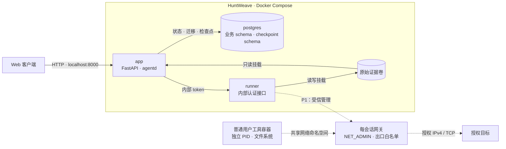

# HuntWeave

面向已授权目标的 Agent 安全测试平台。以 LLM 驱动研究决策，通过受控执行、原始证据、独立复审与人工确认形成可追溯结论。

> **开发阶段：P0。** 已完成运行骨架、Windows 本机隔离技术验证，以及登录、授权快照与持久化假 Run。Agent 研究循环、工具执行与时间线尚未交付，当前版本不能发起安全测试。

## 架构

采用单一 Docker Compose 项目，`app`、`postgres`、`runner` 为常驻服务。准备环境与工具会话由受信执行层按需管理。



实线表示已搭建的服务及存储关系；虚线表示待接入产品的执行链路。默认 Runner 未挂载 Docker socket。每会话网关方案已通过本地靶场验证，P1 接入执行票据、租约、资源管理和 Kali 工具环境后复验。

目标工作流：`Collector → Worker × N → Reviewer → 人工复审`。技术栈为 Python、FastAPI、SQLAlchemy / Alembic、PostgreSQL、LangGraph OSS、Vue 3 / TypeScript 和 Docker Compose。

## 环境要求

| 平台 | 容器运行时 | 当前状态 |
| --- | --- | --- |
| Windows 11 x86_64 | Docker Desktop，WSL2 后端，Linux containers | 已完成本机启动及隔离技术验证 |
| Linux x86_64 | Docker Engine + Compose 插件 | 共用部署入口，理论可部署；原生宿主验收待完成 |

宿主依赖：Git、Python 3.10+ 和可访问的 Docker CLI。Python 仅用于部署辅助入口，业务运行依赖由容器提供。独立的 Kali WSL 发行版不是项目依赖。

安装参考：[Docker Desktop](https://docs.docker.com/desktop/setup/install/windows-install/)、[WSL2](https://learn.microsoft.com/windows/wsl/install)、[Docker Engine](https://docs.docker.com/engine/install/)、[Python](https://www.python.org/downloads/)。

本轮已验证 Engine 29.7.2、Compose 5.4.0；此前宿主隔离验证版本见对应验证记录。Python 依赖与前端依赖分别固定在 `backend/uv.lock`、`frontend/package-lock.json`，基础镜像及 Node 构建镜像固定 digest。

## 部署

以下命令在仓库根目录执行。Windows 使用 `python`；Linux 使用 `python3`。

```sh
git clone --branch main --single-branch https://github.com/kksty/HuntWeave.git
cd HuntWeave

python deploy/initialize.py
docker compose -f deploy/compose.yaml build app
docker compose -f deploy/compose.yaml up -d --no-build --wait --wait-timeout 150
docker compose -f deploy/compose.yaml ps
```

已有工作区使用 `git pull --ff-only` 更新。首次启动生成独立 secrets、构建镜像、初始化持久卷，并在 API/agentd 启动前完成业务与 checkpoint 迁移。初始化入口保留已有 secrets。

三个服务应为 `healthy`。存活接口：`http://127.0.0.1:8000/health/live`。

浏览器打开 `http://127.0.0.1:8000`，未登录时进入最小登录页。登录密钥由初始化入口生成在 `runtime/secrets/access_key`，在本机自行读取并填入；不要将它发到聊天、URL 或提交到 Git。未认证的 API/业务文件仍返回 401；缺失或空密钥返回 503 / `access_key_missing`。默认仅绑定 localhost，PostgreSQL 与 Runner 不发布宿主端口。

app/runner 共用控制镜像，因此先单独 `build app`，再启动三个服务。本轮 Windows 中文路径下，同时构建两服务触发了 Docker 构建会话错误；以上分步入口已实际验证。

登录后创建项目 → 粘贴并预览 IP → 展开 TCP 端口 → 填写有效期、授权说明和预算 → 保存授权快照 → 创建假 Run → 加入队列。记录能在刷新或服务重启后读取；当前 queued 表示持久化待执行，假执行器由下一切片交付。非法行必须修正或移除；重复 IP 合并；未启用 IPv6 隔离，因此 IPv6 目标可以预览但不能提交任务。页面始终标注“开发演示 / 假执行”。

### 配置

| 配置 | 默认值 / 位置 |
| --- | --- |
| Compose 项目名 | `huntweave` |
| Web 监听 | `127.0.0.1:8000` |
| Web 端口覆盖 | `HUNTWEAVE_WEB_PORT` |
| 浏览器同源入口 | `HUNTWEAVE_PUBLIC_ORIGIN`，默认 `http://127.0.0.1:<Web 端口>` |
| HTTPS Cookie | `HUNTWEAVE_COOKIE_SECURE=true`，要求 HTTPS Origin；远程 HTTP 配置拒绝启动 |
| 平台、Runner 与数据库 secrets | `runtime/secrets/` |

端口覆盖可写入仓库根目录的 `.env`：

```dotenv
HUNTWEAVE_WEB_PORT=8080
```

使用自定义文件时，在 Compose 命令中指定 `--env-file .env`：

```sh
docker compose --env-file .env -f deploy/compose.yaml build app
docker compose --env-file .env -f deploy/compose.yaml up -d --no-build --wait --wait-timeout 150
```

## 运行维护

### 开发模式

开发时使用 [Compose Watch](https://docs.docker.com/compose/how-tos/file-watch/)（Compose 2.32+）：

```sh
docker compose -f deploy/compose.yaml -f deploy/compose.dev.yaml up --build --watch
```

源码变化同步至 app/runner 并重启服务，覆盖 API 和 agentd；迁移变化同步并重启 app，在启动阶段应用迁移。`pyproject.toml`、`uv.lock` 和 Dockerfile 变化触发镜像重建；前端源码/锁文件/构建配置、常用端口 profile 变化重建 app。`initial_sync` 在监测开始时核对已有容器中的后端源码。

开发构建阶段为非 root 用户提供可写源码目录，开发覆盖配置开放容器根文件系统写入；secret、证据挂载及服务权限沿用基础配置。该模式仅用于本地开发，服务重启会中断正在处理的请求和研究进程。

### 部署模式

```sh
# 状态与日志
docker compose -f deploy/compose.yaml ps
docker compose -f deploy/compose.yaml logs --tail 100 app runner postgres

# 停止；持久数据保留
docker compose -f deploy/compose.yaml down

# 更新与重建
git pull --ff-only
docker compose -f deploy/compose.yaml build app
docker compose -f deploy/compose.yaml up -d --no-build --wait --wait-timeout 150
```

基础部署不启用 Watch，源码变更通过重建生效。数据库主版本和 secrets 不随更新自动轮换；已有数据库密码需通过独立迁移流程变更。

轮换平台访问密钥：`python deploy/rotate_access_key.py`。入口在原文件中更新，不打印密钥；下一请求拒绝旧会话，重新在本机读取新密钥后登录。会话闲置 2 小时、绝对 24 小时到期；变更接口检查 Origin 与 CSRF；登录限速以真实连接来源和全局尝试数持久化，不信任转发头。本机开发使用独立 HttpOnly / SameSite=Strict Cookie；HTTPS 配置使用 Secure / __Host- Cookie。反向代理、TLS 证书与远程生产部署验收仍待交付。

| 持久内容 | 位置 |
| --- | --- |
| Secrets | `runtime/secrets/`，不入 Git |
| 业务数据与 checkpoints | `huntweave_postgres_data` Docker 卷 |
| 原始证据 | `huntweave_evidence` Docker 卷 |

`down` 保留卷，`down -v` 删除卷。换机器获取源码并初始化将建立独立环境；迁移已有环境需要同时保留匹配的 secrets、PostgreSQL 一致性备份与证据归档。完整备份恢复流程尚未验收。

## 验证

回归检查通过按需容器执行：

```sh
docker compose -f deploy/compose.yaml -f deploy/compose.verify.yaml --profile verify build checks
docker compose -f deploy/compose.yaml -f deploy/compose.verify.yaml --profile verify run --rm --no-deps checks python -m pytest -p no:cacheprovider tests
```

身份与 Run 的故障测试会清空其测试数据库中的演示表，只允许在显式的一次性数据库上运行。默认命令跳过这些测试，仍运行现有启动集成和纯单元检查。完整 P0-B 验证使用独立项目；Windows PowerShell 在仓库根目录执行：

```powershell
$env:HUNTWEAVE_WEB_PORT = "18000"
$env:HUNTWEAVE_DISPOSABLE_TEST_DATABASE = "1"
docker compose --project-name huntweave-p0b-checks -f deploy/compose.yaml up -d --no-build --wait --wait-timeout 150
docker compose --project-name huntweave-p0b-checks -f deploy/compose.yaml -f deploy/compose.verify.yaml --profile verify run --rm --no-deps checks python -m pytest -p no:cacheprovider tests

cd frontend
npm ci
npx playwright install chromium
$env:HUNTWEAVE_E2E_BASE_URL = "http://127.0.0.1:18000"
npm run test:e2e
cd ..

docker compose --project-name huntweave-p0b-checks -f deploy/compose.yaml down -v
Remove-Item Env:HUNTWEAVE_WEB_PORT, Env:HUNTWEAVE_DISPOSABLE_TEST_DATABASE, Env:HUNTWEAVE_E2E_BASE_URL
```

`down -v` 在此只用于删除自己创建的一次性验收项目。测试用文档保留 IP，不连接目标；浏览器截图保存在被忽略的 `runtime/validation/`。前端类型/构建验证为 `cd frontend` 后 `npm run build`。本轮 52 个后端检查、2 个浏览器流程通过，细节见身份与 Run 验证记录。

日常本机开发只保留 `huntweave` 一组服务。浏览器检查默认访问 localhost:8000，追加假项目和 Run，不清空数据库；无需保留验收项目。完整故障验收的独立项目仅临时使用，结束后立即删除其容器/测试卷。

启动故障与隔离探针入口：

```sh
python deploy/verify_startup.py
python -m pip install --require-hashes -r deploy/verification-requirements.txt
python deploy/verify_isolation.py
```

故障探针会短暂停止本项目服务；隔离探针创建独立靶场资源，只有可信管理容器获得 Docker API。结果保存在 `runtime/isolation/`。当前 Windows 记录为 39 项探针、18 项回归通过；Linux 容器测试不替代原生 Linux 宿主验收。

## 项目资料

- [项目总纲](./PROJECT.md) · [P0 规格](./docs/specs/0001-foundation.md)
- [架构决策](./docs/adr/README.md) · [Agent 开发约定](./AGENTS.md)
- [启动验证记录](./docs/validation/0001-startup.md) · [隔离验证记录](./docs/validation/0002-windows-isolation.md)
- [身份与 Run 验证记录](./docs/validation/0004-identity-runs.md)
- [GitHub Issues](https://github.com/kksty/HuntWeave/issues)

下一实施项：[运行确定性 Agent 并展示证据时间线 · #4](https://github.com/kksty/HuntWeave/issues/4)。P0 后续完成确定性 Agent、假执行时间线、暂停取消与恢复；P1 接入真实执行，P2 形成完整 Agent MVP。

## 许可证

[GPL-3.0-only](./LICENSE)。共享开发技能的来源与 MIT 许可证记录位于 [.agents/sources/](./.agents/sources/)。
