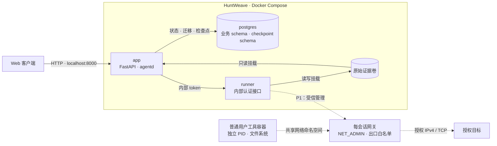

# HuntWeave

面向已授权目标的 Agent 安全测试平台。以 LLM 驱动研究决策，通过受控执行、原始证据、独立复审与人工确认形成可追溯结论。

> 当前阶段、已交付能力、下一实施项与已知限制统一记录在 [docs/STATUS.md](./docs/STATUS.md)。请先核对能力状态再使用执行入口；本文件只说明安装、部署、开发与验证入口，不复述阶段状态。

## 架构

采用单一 Docker Compose 项目，`app`、`postgres`、`runner` 为常驻服务。准备环境与工具会话由受信执行层按需管理。



实线表示已搭建的服务及存储关系；虚线表示待接入产品的执行链路。默认 Runner 未挂载 Docker socket，也不启用沙箱管理；只有显式用 `deploy/compose.sandbox.yaml` 启用后，Runner 才获得收窄的固定操作集（见「沙箱管理」一节）。每会话网关方案已通过本地靶场验证，其无目标网络的固定生命周期已接入 Runner 的受信管理组件（验证记录 `0011`）；出口放行与真实动作派发仍待 #18/#17。

目标工作流：`Collector → Worker × N → Reviewer → 人工复审`。技术栈为 Python、FastAPI、SQLAlchemy / Alembic、PostgreSQL、LangGraph OSS、Vue 3 / TypeScript 和 Docker Compose。

后续架构采用证据驱动的任务规划：服务事实与研究依赖分别记录，Run 内规划按有效事件提出零到多项建议，`runs` 统一提交任务，Worker 保留任务内方法选择；证据显式绑定，复审与报告按输入版本保存。24×7 指一次发布后，同一 Run 在有效授权和预算内持续推进，完成后停止，重启先对账再接续。设计取舍见 [ADR 索引](./docs/adr/README.md)，实施组织见 [P2 规格](./docs/specs/0003-agent-research.md)。已确认但待实施的行为分别见 [能力判据](./docs/specs/0005-capability-claim-criteria.md)、[状态/确认/冻结/迁移](./docs/specs/0006-state-model-and-delivery.md) 与 [研究工作台 UI](./docs/specs/0007-research-workbench-ui.md)，不把设计规格当作现有功能。

正常交付顺序为 **自主渗透并留证 → AI 复审及有限补证 → 自动执行结束、释放执行资源 → 人工复审**。人工未处理结论时，证据继续按策略保留，自动执行已经停止；AI 复审无法完成等例外会明确记录原因和未决项。

目标验证规则包含默认 RCE 最小只读留证后退出、禁止破坏或删改目标已有数据、必要新增测试数据及遗留披露，见 [PROJECT 第 9.1 节](./PROJECT.md)。规划中的正式漏洞库采用 [CVSS v4.0 与独立准入门槛](./docs/specs/0004-finding-admission.md)，低危/无害信息和未证实版本命中保留研究记录；当前实现状态以 STATUS 为准。

## 环境要求

| 平台 | 容器运行时 | 当前状态 |
| --- | --- | --- |
| Windows 11 x86_64 | Docker Desktop，WSL2 后端，Linux containers | 已完成本机启动及隔离技术验证 |
| Linux x86_64 | Docker Engine + Compose 插件 | 共用部署入口，理论可部署；原生宿主验收待完成 |

宿主依赖：Git、Python 3.10+（仅部署辅助入口）和可访问的 Docker CLI；业务运行依赖全部由容器提供。前端开发与浏览器验证另需 Node 22+。独立的 Kali WSL 发行版不是项目依赖。

安装参考：[Docker Desktop](https://docs.docker.com/desktop/setup/install/windows-install/)、[WSL2](https://learn.microsoft.com/windows/wsl/install)、[Docker Engine](https://docs.docker.com/engine/install/)、[Python](https://www.python.org/downloads/)。

已验证宿主版本以各验证记录的实测值为准：启动与隔离验证为 Docker Desktop 4.94.0 / Engine 29.8.2 / Compose 5.5.1（见 [0001](./docs/validation/0001-startup.md)、[0002](./docs/validation/0002-windows-isolation.md)），P0-B 切片记录为 Engine 29.7.2 / Compose 5.4.0（见 [0004](./docs/validation/0004-identity-runs.md)）。Python 依赖与前端依赖分别固定在 `backend/uv.lock`、`frontend/package-lock.json`，基础镜像及 Node 构建镜像固定 digest。

## 部署

以下命令在仓库根目录执行。Windows 使用 `python`；Linux 使用 `python3`。

```sh
git clone --branch main --single-branch https://github.com/kksty/HuntWeave.git
cd HuntWeave

python deploy/initialize.py
docker compose -f deploy/compose.yaml build app
docker compose -f deploy/compose.yaml up -d --no-build --wait --wait-timeout 150
docker compose -f deploy/compose.yaml ps
```

已有工作区使用 `git pull --ff-only` 更新。首次启动生成独立 secrets、构建镜像、初始化持久卷，并在 API/agentd 启动前完成业务与 checkpoint 迁移。初始化入口保留已有 secrets。

三个服务应为 `healthy`。存活接口：`http://127.0.0.1:8000/health/live`。

浏览器打开 `http://127.0.0.1:8000`，未登录时进入最小登录页。登录密钥由初始化入口生成在 `runtime/secrets/access_key`，在本机自行读取并填入；不要将它发到聊天、URL 或提交到 Git。未认证的 API/业务文件仍返回 401；缺失或空密钥返回 503 / `access_key_missing`。默认仅绑定 localhost，PostgreSQL 与 Runner 不发布宿主端口。

app/runner 共用控制镜像，因此先单独 `build app`，再启动三个服务。本轮 Windows 中文路径下，同时构建两服务触发了 Docker 构建会话错误；以上分步入口已实际验证。

登录后创建项目 → 粘贴并预览 IP → 展开 TCP 端口 → 填写有效期、授权说明和预算 → 保存授权快照 → 选择假输出场景 → 创建假 Run → 加入队列。唯一的调度进程会领取 queued Run，按 Collector → Worker → Reviewer 依次派发固定假动作，逐次把决策摘要、实际调用参数、输出、耗时、证据哈希与事件游标写入持久记录，并在“玻璃鱼缸”页面通过 SSE 展示；自动阶段结束后进入 `awaiting_human`，可查看恢复预览、结束演示或取消。记录在刷新或服务重启后读取一致。单 Run 导入上限为 **100 个 IP**（`PROJECT.md` §12 的保守开发默认值，按去重后的不同目标计数）。非法行必须修正或移除；重复 IP 合并；未启用 IPv6 隔离，因此 IPv6 目标可以预览但不能提交任务。页面始终标注“开发演示 / 假执行”，其输出来自固定假动作，不连接授权 IP，也不形成真实漏洞结论。

### 配置

| 配置 | 默认值 / 位置 |
| --- | --- |
| Compose 项目名 | `huntweave` |
| Web 监听 | `127.0.0.1:8000` |
| Web 端口覆盖 | `HUNTWEAVE_WEB_PORT` |
| 浏览器同源入口 | `HUNTWEAVE_PUBLIC_ORIGIN`，默认 `http://127.0.0.1:<Web 端口>` |
| HTTPS Cookie | `HUNTWEAVE_COOKIE_SECURE=true`，要求 HTTPS Origin；远程 HTTP 配置拒绝启动 |
| 沙箱管理 | `HUNTWEAVE_SANDBOX_MANAGEMENT=enabled` 才启用（默认关闭，其他取值一律不启用），仅应由 `deploy/compose.sandbox.yaml` 设置 |
| 沙箱执行 profile | `HUNTWEAVE_SANDBOX_PROFILE`，默认 `sandbox-lifecycle-v1`；profile 文件由镜像内 `/opt/huntweave/profiles/` 提供 |
| 平台、Runner 与数据库 secrets | `runtime/secrets/` |

端口覆盖可写入仓库根目录的 `.env`：

```dotenv
HUNTWEAVE_WEB_PORT=8080
```

使用自定义文件时，在 Compose 命令中指定 `--env-file .env`：

```sh
docker compose --env-file .env -f deploy/compose.yaml build app
docker compose --env-file .env -f deploy/compose.yaml up -d --no-build --wait --wait-timeout 150
```

## 运行维护

### 开发模式

开发时使用 [Compose Watch](https://docs.docker.com/compose/how-tos/file-watch/)（Compose 2.32+）：前端在宿主上持续构建，容器只消费产物。`frontend/dist` 必须在启动 watch 前存在，否则 `up --watch` 会以 `GetFileAttributesEx ... The system cannot find the file specified.` 退出（exit 1）；首次先跑一次 `npm run build`，或让下面前端终端保持在运行状态。

```sh
# 终端 1：前端在宿主上构建（首次先 npm ci）
cd frontend
npm ci
npm run build:watch

# 终端 2：仓库根目录
docker compose -f deploy/compose.yaml -f deploy/compose.dev.yaml up --build --watch
```

后端源码变化同步至 app/runner 并重启这两个服务，覆盖 API 和 agentd；迁移变化同步并重启 app，在启动阶段应用迁移。`pyproject.toml`、`uv.lock`、`profiles/common-tcp-v1.json` 和 Dockerfile 变化触发镜像重建。同步按**改动**触发：附着 watch 不会把启动前已存在的文件（后端源码或前端产物）复制进容器，因此容器在附着后仍提供镜像内的构建产物，直到第一次改动被同步；后端源码的第一次改动会重启 app/runner，前端改动同步时不重启服务。要让容器立刻用上宿主产物，附着后再保存一次前端文件即可（`npm run build:watch` 会重建并触发同步）。实测与更正见 [0009](./docs/validation/0009-frontend-watch-sync.md)。

前端源码与构建配置变化不再触发镜像重建：`npm run build:watch` 在宿主重建 `frontend/dist`，Compose Watch 只做文件同步（`action: sync`），app 按请求从磁盘读取静态资源，因此改前端既不重启服务，也不在容器内重跑 `npm ci` / `vite build`。前端构建失败时容器继续提供上一次成功产物，不会中断正在运行的服务；改动前端依赖后需在宿主重新 `npm ci`。类型检查与生产构建仍以 `npm run build`（含 `vue-tsc --noEmit`）和 CI 为准。

开发构建阶段为非 root 用户提供可写源码目录，开发覆盖配置开放容器根文件系统写入；secret、证据挂载及服务权限沿用基础配置。该模式仅用于本地开发，服务重启会中断正在处理的请求和研究进程；数据库与证据卷保留。

### 沙箱管理（默认关闭）

Runner 内的受信管理组件是唯一接触容器管理接口的组件，它只实现一组固定操作（创建/启动/停止会话容器、创建与回收每会话网络、网关与私有工作区卷、按本项目标签查询资源与进程、读取有界日志、解析镜像），容器镜像、用户、挂载、网络模式、capabilities 与限额全部来自提交进仓库的版本化 profile。**启用前 Runner 没有任何容器管理能力**，升级不会静默打开真实出网。

显式启用需要同时给出基础文件与该覆盖文件：

```sh
docker compose -f deploy/compose.yaml -f deploy/compose.sandbox.yaml up -d --build
```

覆盖文件只作用于 `runner`：挂载 `/var/run/docker.sock`、加入 `group_add: ["0"]`（本机 socket 为 `root:root 0660`，而 Runner 以 uid 10001 运行），并设置 `HUNTWEAVE_SANDBOX_MANAGEMENT=enabled` 与 `HUNTWEAVE_SANDBOX_PROFILE`。常驻服务仍是 `app`/`postgres`/`runner` 三个，`app` 永远没有 socket。

启用管理**不等于**开放真实执行：`real_execution_ready` 仍由 ADR-0010 的四项门槛决定，`/api/v1/system/capabilities` 会把它作为独立的 `sandbox_management`（`disabled`/`ready`/`unavailable` 加原因码）报出。恢复默认部署用基础文件重启即可（`docker compose -f deploy/compose.yaml up -d --no-build runner`）。

所选 profile 同时决定出口：网关加入的目标网络、安装与回读放行规则的固定命令与执行用户、网关的就绪检查、以及就绪与撤销时限。管理器在网关报告就绪后才放行，并在每次放行后回读内核规则核对；平台自身网络、所用桥的宿主侧地址与固定保留网段一律拒绝，部署额外的宿主网段需写进该 profile 的 `network.protected`。回退由执行端的 `begin_revert` 顺序执行（拒绝新实例 → 撤销 → 停止 → 回收 → 对账归档），只有在没有未核清项时才报告可以撤除管理能力；面向操作员的入口随窗口控制台（#19）提供。

### 部署模式

```sh
# 状态与日志
docker compose -f deploy/compose.yaml ps
docker compose -f deploy/compose.yaml logs --tail 100 app runner postgres

# 停止；持久数据保留
docker compose -f deploy/compose.yaml down

# 更新与重建
git pull --ff-only
docker compose -f deploy/compose.yaml build app
docker compose -f deploy/compose.yaml up -d --no-build --wait --wait-timeout 150
```

基础部署不启用 Watch，源码变更通过重建生效。数据库主版本和 secrets 不随更新自动轮换；已有数据库密码需通过独立迁移流程变更。

轮换平台访问密钥：`python deploy/rotate_access_key.py`。入口在原文件中更新，不打印密钥；下一请求拒绝旧会话，重新在本机读取新密钥后登录。会话闲置 2 小时、绝对 24 小时到期；变更接口检查 Origin 与 CSRF；登录限速以真实连接来源和全局尝试数持久化，不信任转发头。本机开发使用独立 HttpOnly / SameSite=Strict Cookie；HTTPS 配置使用 Secure / __Host- Cookie。反向代理、TLS 证书与远程生产部署验收仍待交付。

| 持久内容 | 位置 |
| --- | --- |
| Secrets | `runtime/secrets/`，不入 Git |
| 业务数据与 checkpoints | `huntweave_postgres_data` Docker 卷 |
| 原始证据 | `huntweave_evidence` Docker 卷 |

`down` 保留卷，`down -v` 删除卷。换机器获取源码并初始化将建立独立环境；迁移已有环境需要同时保留匹配的 secrets、PostgreSQL 一致性备份与证据归档。完整备份恢复流程尚未验收。

## 验证

各切片的实际覆盖、检查计数、失败边界与未达成项见 [验证记录索引](./docs/validation/README.md)，阶段与能力状态见 [STATUS](./docs/STATUS.md)；本节只给出可复现的入口，不复述验收结论。

回归检查通过按需容器执行：

```sh
docker compose -f deploy/compose.yaml -f deploy/compose.verify.yaml --profile verify build checks
docker compose -f deploy/compose.yaml -f deploy/compose.verify.yaml --profile verify run --rm --no-deps checks python -m pytest -p no:cacheprovider tests
```

集成检查会清空其测试数据库中的演示表，并真的启动假执行，只允许在显式的一次性数据库上运行。默认命令跳过这些集成项，仍运行启动集成与纯单元检查。完整 P0 验收使用独立项目；Windows PowerShell 在仓库根目录执行：

```powershell
$env:HUNTWEAVE_WEB_PORT = "18000"
$env:HUNTWEAVE_PUBLIC_ORIGIN = "http://127.0.0.1:18000"
$env:HUNTWEAVE_DISPOSABLE_TEST_DATABASE = "1"
docker compose --project-name huntweave-p0-checks -f deploy/compose.yaml build app
docker compose --project-name huntweave-p0-checks -f deploy/compose.yaml -f deploy/compose.verify.yaml --profile verify build checks
docker compose --project-name huntweave-p0-checks -f deploy/compose.yaml up -d --no-build --wait --wait-timeout 180
docker compose --project-name huntweave-p0-checks -f deploy/compose.yaml -f deploy/compose.verify.yaml --profile verify run --rm --no-deps checks python -m pytest -p no:cacheprovider tests

python deploy/verify_startup.py --project huntweave-p0-checks --web-port 18000
python deploy/verify_p0.py --project huntweave-p0-checks --base-url http://127.0.0.1:18000

cd frontend
npm ci
npx playwright install chromium
$env:HUNTWEAVE_E2E_BASE_URL = "http://127.0.0.1:18000"
# verify_p0.py 的核对探针会打印 CONSOLE_RECONCILIATION_RUN=<run_id>，用它跑控制台核对路径：
$env:HUNTWEAVE_E2E_RECONCILE_RUN_ID = "<run_id>"
npm run test:e2e
cd ..

docker compose --project-name huntweave-p0-checks -f deploy/compose.yaml down -v
Remove-Item Env:HUNTWEAVE_WEB_PORT, Env:HUNTWEAVE_PUBLIC_ORIGIN, Env:HUNTWEAVE_DISPOSABLE_TEST_DATABASE, Env:HUNTWEAVE_E2E_BASE_URL
```

`verify_p0.py` 只接受 `huntweave-p0-checks` 项目与回环非 8000 端口，会重启 app/Runner、停止 PostgreSQL、撤销 checkpoint 写权限并临时改名一条证据文件，结束后在 `finally` 中恢复；它不发送任何目标流量。它是唯一能对真实进程与卷注入故障的验证层（验收容器无 Docker 访问），因此不与后端检查重复覆盖：后者在被测进程内验证同一行为，这里验证的是重启、停库、撤权与归档损坏之后它仍然成立。核对探针会额外留下一个结果未知的 Run 并打印其 id，供上面的浏览器核对路径使用；只要检查、不需要该 fixture 时加 `--no-console-fixture`。`down -v` 在此只用于删除自己创建的一次性验收项目。测试用文档保留 IP，不连接目标；浏览器截图保存在被忽略的 `runtime/validation/`。

本地纯检查与前端构建（不含容器）。这些命令必须在 `backend/` 目录内执行：pytest 相对 rootdir 解析 `pythonpath`，在仓库根目录直接运行会因找不到 `huntweave` 包而整批收集失败：

```sh
cd backend
.venv/Scripts/python -m pytest -m "not integration" -q   # Linux 为 .venv/bin/python
.venv/Scripts/ruff check src tests
.venv/Scripts/mypy --config-file pyproject.toml src       # 严格类型（Linux 平台设置）
cd ../frontend && npm run build
```

CI（`.github/workflows/checks.yml`）运行同一组纯检查与前端构建，另有 `uv sync --frozen` 校验依赖锁。集成检查、启动/恢复故障探针和浏览器流程需要 Docker 与一次性栈，仍按上文手工执行。

日常本机开发只保留 `huntweave` 一组服务。浏览器检查默认访问 localhost:8000，追加假项目和 Run，不清空数据库；无需保留验收项目。完整故障验收的独立项目仅临时使用，结束后立即删除其容器/测试卷。

启动故障与隔离探针入口：

```sh
python deploy/verify_startup.py
python -m pip install --require-hashes -r deploy/verification-requirements.txt
python deploy/verify_isolation.py
python deploy/verify_lifecycle.py
python deploy/verify_egress.py
python deploy/verify_action.py
```

故障探针会短暂停止本项目服务；隔离探针创建独立靶场资源，只有可信管理容器获得 Docker API。结果保存在 `runtime/isolation/`，Windows 当前的探针计数、实际宿主版本与报告 hash 见[隔离验证记录](./docs/validation/0002-windows-isolation.md)；Linux 容器测试不替代原生 Linux 宿主验收。

沙箱生命周期探针只跑**无目标网络**的固定生命周期检查：它在同样只有 Docker API 的容器里驱动产品自己的受信管理组件，创建一轮会话容器后读回事实、停止并回收，不创建目标网络、不发起任何目标流量，也不为跑测试把产品就绪门槛改成 true。结果保存在 `runtime/sandbox/`，计数、限制与待确认项见[验证记录 `0011`](./docs/validation/0011-p1-sandbox-lifecycle.md)。

出口探针 `deploy/verify_egress.py` 走同一条路，但它会在**本机靶场桥接网络**上创建三个固定回显容器（授权、未授权、控制网络各一个），验证默认拒绝、只放行授权 IPv4/TCP、平台地址与桥接宿主地址被拒、撤销在 profile 时限内生效、取消与租约到期后进程与连接回收、回退序列与对账归档。它不接触任何外部地址，也不改产品就绪门槛；结果见[验证记录 `0012`](./docs/validation/0012-p1-egress-and-cancel.md)。探针创建的资源按自己的标签与本轮 Run 身份回收，结束后报告 `leftovers` 必须为空。

动作探针 `deploy/verify_action.py` 构建产品自己的 Runner（启用受信管理），向它的 HTTP 表面提交真实票据，让真实执行器在靶场容器里跑 `shell.exec`、`discover_tcp_services` 与 `probe_http`，并用 Docker SDK 与证据目录读回事实：命令以 profile 的普通用户在 profile 指定的工作目录（`workspace.mount`）内执行、stdout/stderr 与退出码按先文件后 hash 归档、放行只含票据的目标端点、调用结束后实例与许可都不残留，以及**按工具真实返回决定下一个动作并真的执行**（有端口的发现引出 HTTP 请求，无端口则结束研究）。它同样只用 `lab/` 靶场与回环入口，不接触外部地址；结果见[验证记录 `0013`](./docs/validation/0013-p1-real-actions.md) 与 [`0014`](./docs/validation/0014-p1-stop-confirmation-and-cwd.md)。

## 项目资料

状态与规格

- [当前状态](./docs/STATUS.md)：阶段、已交付能力与下一实施项的**唯一状态源**
- [项目总纲](./PROJECT.md) · [P0 规格](./docs/specs/0001-foundation.md) · [P1 规格](./docs/specs/0002-real-execution.md) · [P2 规格](./docs/specs/0003-agent-research.md) · [漏洞库准入规格](./docs/specs/0004-finding-admission.md) · [能力类主张判据规格](./docs/specs/0005-capability-claim-criteria.md)
- [状态、确认等级与冻结交付](./docs/specs/0006-state-model-and-delivery.md) · [研究工作台 UI](./docs/specs/0007-research-workbench-ui.md) · [本轮设计取舍](./docs/research/2026-10-10-state-model-and-ui-review.md) · [ADR-0017](./docs/adr/0017-claim-confirmation-and-frozen-delivery.md)

决策记录

- [ADR 索引](./docs/adr/README.md) · [真实执行边界与门槛](./docs/adr/0010-real-execution-boundary-and-gate.md) · [计划与证据版本](./docs/adr/0011-planning-authority-and-evidence-revisions.md) · [最小实证与目标数据](./docs/adr/0012-minimal-proof-and-target-data.md) · [严重性与准入](./docs/adr/0013-severity-and-finding-admission.md) · [执行生命周期与环境身份](./docs/adr/0014-execution-lifecycle-and-environment-identity.md) · [研究图语义与投影边界](./docs/adr/0015-graph-semantics-and-projection-boundary.md) · [调度、槽位与资源政策](./docs/adr/0016-scheduling-and-resource-policy.md)

研究记录

- [架构评估与设计取舍](./docs/research/2026-10-09-architecture-assessment.md)：问题核对、备选方案比较与取舍依据

验证记录

- [验证记录索引](./docs/validation/README.md)：`0001` 启动 · `0002` Windows 隔离 · `0003` Compose Watch · `0004` 身份与假 Run · `0005` P0-C/D 执行与恢复 · `0006` P1 核对入口 · `0007` P1 票据目标绑定 · `0008` P1 目标上限 · `0009` 前端产物同步开发入口 · `0010` P1 能力就绪状态与控制冲突 · `0011` P1 受信管理组件与真实容器生命周期 · `0012` P1 出口控制与取消/回收 · `0013` P1 真实动作最小闭环

开发协作

- [Agent 开发约定](./AGENTS.md) · [领域文档与术语](./docs/agents/domain.md) · [Issue 跟踪](./docs/agents/issue-tracker.md) · [Triage 标签](./docs/agents/triage-labels.md)
- [术语表](./GLOSSARY.md) · [GitHub Issues](https://github.com/kksty/HuntWeave/issues) · [P1 里程碑](https://github.com/kksty/HuntWeave/milestone/1)

阶段交付和未开放能力只以 STATUS 为入口；各项验证记录说明实际覆盖与限制。原生 Linux 宿主验收按 ADR-0010 另立切片，不作为 P1 前置。使用和部署说明保留在本文件，产品规则与正式验收分别见总纲和各阶段规格。

## 许可证

[GPL-3.0-only](./LICENSE)。共享开发技能的来源与 MIT 许可证记录位于 [.agents/sources/](./.agents/sources/)。
