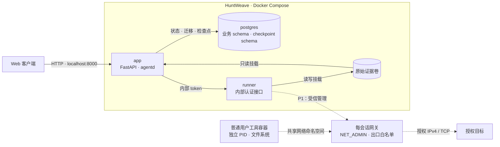

# HuntWeave

面向已授权目标的 Agent 安全测试平台。以 LLM 驱动研究决策，通过受控执行、原始证据、独立复审与人工确认形成可追溯结论。

> **开发阶段：P0。** 已完成运行骨架与 Windows 本机隔离技术验证；登录、授权 Run、Agent 研究循环和工具执行尚未交付。当前版本不能发起安全测试。

## 架构

采用单一 Docker Compose 项目，`app`、`postgres`、`runner` 为常驻服务。准备环境与工具会话由受信执行层按需管理。



实线表示已搭建的服务及存储关系；虚线表示待接入产品的执行链路。默认 Runner 未挂载 Docker socket。每会话网关方案已通过本地靶场验证，P1 接入执行票据、租约、资源管理和 Kali 工具环境后复验。

目标工作流：`Collector → Worker × N → Reviewer → 人工复审`。技术栈为 Python、FastAPI、SQLAlchemy / Alembic、PostgreSQL、LangGraph OSS、Vue 3 / TypeScript 和 Docker Compose。

## 环境要求

| 平台 | 容器运行时 | 当前状态 |
| --- | --- | --- |
| Windows 11 x86_64 | Docker Desktop，WSL2 后端，Linux containers | 已完成本机启动及隔离技术验证 |
| Linux x86_64 | Docker Engine + Compose 插件 | 共用部署入口，理论可部署；原生宿主验收待完成 |

宿主依赖：Git、Python 3.10+ 和可访问的 Docker CLI。Python 仅用于部署辅助入口，业务运行依赖由容器提供。独立的 Kali WSL 发行版不是项目依赖。

安装参考：[Docker Desktop](https://docs.docker.com/desktop/setup/install/windows-install/)、[WSL2](https://learn.microsoft.com/windows/wsl/install)、[Docker Engine](https://docs.docker.com/engine/install/)、[Python](https://www.python.org/downloads/)。

已验证版本：Docker Desktop 4.94.0、Engine 29.8.2、Compose 5.5.1、WSL 3.0.1。镜像 digest 和 Python 制品版本分别固定在构建配方与 `backend/uv.lock`。

## 部署

以下命令在仓库根目录执行。Windows 使用 `python`；Linux 使用 `python3`。

```sh
git clone --branch main --single-branch https://github.com/kksty/HuntWeave.git
cd HuntWeave

python deploy/initialize.py
docker compose -f deploy/compose.yaml up -d --build --wait --wait-timeout 150
docker compose -f deploy/compose.yaml ps
```

已有工作区使用 `git pull --ff-only` 更新。首次启动生成独立 secrets、构建镜像、初始化持久卷，并在 API/agentd 启动前完成业务与 checkpoint 迁移。初始化入口保留已有 secrets。

三个服务应为 `healthy`。存活接口：`http://127.0.0.1:8000/health/live`。

当前主页和业务路径返回 401；缺失或空访问密钥返回 503 / `access_key_missing`。默认仅绑定 localhost，PostgreSQL 与 Runner 不发布宿主端口；远程 HTTPS 生产部署尚未交付。

### 配置

| 配置 | 默认值 / 位置 |
| --- | --- |
| Compose 项目名 | `huntweave` |
| Web 监听 | `127.0.0.1:8000` |
| Web 端口覆盖 | `HUNTWEAVE_WEB_PORT` |
| 平台、Runner 与数据库 secrets | `runtime/secrets/` |

端口覆盖可写入仓库根目录的 `.env`：

```dotenv
HUNTWEAVE_WEB_PORT=8080
```

使用自定义文件时，在 Compose 命令中指定 `--env-file .env`：

```sh
docker compose --env-file .env -f deploy/compose.yaml up -d --build --wait --wait-timeout 150
```

## 运行维护

```sh
# 状态与日志
docker compose -f deploy/compose.yaml ps
docker compose -f deploy/compose.yaml logs --tail 100 app runner postgres

# 停止；持久数据保留
docker compose -f deploy/compose.yaml down

# 更新与重建
git pull --ff-only
docker compose -f deploy/compose.yaml up -d --build --wait --wait-timeout 150
```

容器不实时挂载源码，源码变更通过重建生效。数据库主版本和 secrets 不随更新自动轮换；已有数据库密码需通过独立迁移流程变更。

| 持久内容 | 位置 |
| --- | --- |
| Secrets | `runtime/secrets/`，不入 Git |
| 业务数据与 checkpoints | `huntweave_postgres_data` Docker 卷 |
| 原始证据 | `huntweave_evidence` Docker 卷 |

`down` 保留卷，`down -v` 删除卷。换机器获取源码并初始化将建立独立环境；迁移已有环境需要同时保留匹配的 secrets、PostgreSQL 一致性备份与证据归档。完整备份恢复流程尚未验收。

## 验证

回归检查通过按需容器执行：

```sh
docker compose -f deploy/compose.yaml -f deploy/compose.verify.yaml --profile verify build checks
docker compose -f deploy/compose.yaml -f deploy/compose.verify.yaml --profile verify run --rm --no-deps checks python -m pytest -p no:cacheprovider tests
```

启动故障与隔离探针入口：

```sh
python deploy/verify_startup.py
python -m pip install --require-hashes -r deploy/verification-requirements.txt
python deploy/verify_isolation.py
```

故障探针会短暂停止本项目服务；隔离探针创建独立靶场资源，只有可信管理容器获得 Docker API。结果保存在 `runtime/isolation/`。当前 Windows 记录为 39 项探针、18 项回归通过；Linux 容器测试不替代原生 Linux 宿主验收。

## 项目资料

- [项目总纲](./PROJECT.md) · [P0 规格](./docs/specs/0001-foundation.md)
- [架构决策](./docs/adr/README.md) · [Agent 开发约定](./AGENTS.md)
- [启动验证记录](./docs/validation/0001-startup.md) · [隔离验证记录](./docs/validation/0002-windows-isolation.md)
- [GitHub Issues](https://github.com/kksty/HuntWeave/issues)

下一实施项：[登录并创建授权假 Run · #3](https://github.com/kksty/HuntWeave/issues/3)。P0 后续完成确定性 Agent、假执行时间线、暂停取消与恢复；P1 接入真实执行，P2 形成完整 Agent MVP。

## 许可证

[GPL-3.0-only](./LICENSE)。共享开发技能的来源与 MIT 许可证记录位于 [.agents/sources/](./.agents/sources/)。
