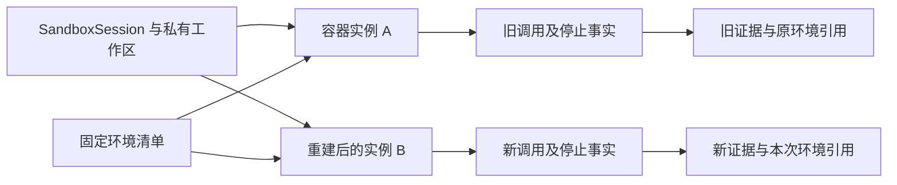

# ADR-0014：执行生命周期与环境身份

日期：2026-10-09。状态：已采纳，待分阶段实施。细化 ADR-0005/0010/0011，保持六个 Module、`app/postgres/runner` 三常驻服务、LangGraph 和 PostgreSQL。

## 背景

有状态执行会带来三组容易混淆的等式：会话延续不等于容器未变，固定环境清单不等于运行健康，命令退出不等于资源回收完成。HuntWeave 已要求调用去重、停止确认、洁净准备和固定工具版本；本决定补足这些要求之间的身份与恢复语义。现有假执行代码不能因此被视为已具备这些真实执行能力。推导过程与备选比较见[架构评估](../research/2026-10-09-architecture-assessment.md)。

## 决定

| 设计 | 所有权与约束 | 代价与收益 |
| --- | --- | --- |
| 区分逻辑执行会话、容器实例、ToolCall | `execution` 保存 SandboxSession 与 AgentSession 的关联、每次创建的实例身份及归属；调用绑定实际实例。实例重建不改旧调用，租约代次只负责控制请求有效性 | 多保存一层身份与历史，避免用新实例观测错误裁定旧执行 |
| 固定环境描述与动态健康分开 | Runner 保存不可变 EnvironmentManifest；当前 profile、隔离、出口、存储和租约检查另有带实例/时间的观测，按执行及续租重新核验 | 环境可解释、版本可追溯，同时避免旧的“就绪”缓存成为执行许可 |
| 准备、执行、停止和证据分别判断 | Runner 提供各阶段事实；`runs` 决定业务状态。创建容器或安装失败不等于已测试目标；退出码不替代停止确认；归档缺失不伪装为完整结果 | 失败与恢复路径更细，透明控制台能准确解释阻断及已有成果 |
| 控制路径独立于慢工作推进 | `runs` 管短事务、控制与预算；harness 在事务外请求模型；Runner 执行有界准备/调用。取消、续租、撤销、对账不排在慢模型或构建之后 | 要验证拥塞下的控制响应，不增加部署服务，也不靠无限并发解决 |
| 独立复现重建环境并复核事实 | Reviewer 取得固定工具/来源及只读证据引用，使用新实例与新工作区。复用环境清单不继承目标会话的可写层、活动进程或“已验证”结论 | 增加必要准备成本；环境不可重建时如实报告，旧证据仍可审阅 |

共享工具继续从洁净来源和配方构建，目标工作区始终私有。Run 固定已选择的版本；后续确需新增版本时显式登记选择与使用，不原地覆盖旧版本。没有活动调用的工作区留存不赋予进程持续访问目标的许可。

下面展示同一逻辑会话重建后的归属；B 仅在 A 的旧调用与资源完成必要核对后用于新调用，重建本身不构成重派许可。

## 明确不采用

本阶段不引入集群存储、云扩容、定制容器运行时、多后端调度或内存快照恢复；不改变普通用户执行与固定 helper 的权限。单机 Compose 使用现有 OCI 镜像、受控只读工具制品和私有工作区表达环境层次。

恢复以业务库、LangGraph 检查点和 Runner 账本分别对账为准。外部目标不会随本地环境回退；无法确认的副作用仍进入 unknown 核对，不用重建、快照或重新开会话规避。

## 实施归属

- P1 #16/#18/#17：实例身份、生命周期记录、规则先于目标进程、停止事实与证据；#19 展示，#20 保护固定环境引用，#21 验证并发下控制与回收。保持 [P1 规格](../specs/0002-real-execution.md) 第 5 节的依赖顺序。
- P2-A：模型在事务外运行、独立任务/会话身份，以及慢模型不阻塞控制的验证。
- P2-C/D：洁净准备、版本化清单、独立复现及环境失败处理；P2-E 验证重启、存储和持续运行。具体要求见 [P2 草案](../specs/0003-agent-research.md)，该草案仍须评审。

先用本地固定靶场证明可停止、可对账、证据可归属，再衡量准备耗时、复用收益和运行成本。此决定不开放真实执行，不修改 GitHub 任务状态，也不构成功能验收。
